# PlantUML Diagrams - INVERSA System
## Activity & Sequence Diagrams for All Use Cases
### Untuk Dokumentasi Bab 3 Skripsi

### USE CASE STRUCTURE:

**GUEST Use Cases (4):**
1. Registrasi
2. Login
3. Membaca Karya
4. Mengikuti Project
5. Mencari Karya
6. Memberikan Like & Komentar
7. Melaporkan Konten

**USER (Logged In) Use Cases (9):**
1. Membuat Proyek Solo
2. Membuat Proyek Tim
3. Mengelola Brainstorming (Parent - includes sub use cases)
   - Tambah Idea
   - Voting Story Ideas
   - Diskusi/Discussion
   - Mengelola Notes
4. Mengelola Chapter (Parent - includes sub use cases)
   - Mengelola Text Cell
   - Mengelola Image Cell
5. Menyimpan Draft
6. Publish Karya
7. Mengelola Permintaan Bergabung (Base - includes sub use cases)
   - Menyetujui Permintaan Bergabung
   - Menolak Permintaan Bergabung

**ADMIN Use Cases (3):**
1. Melihat Dashboard
2. Mengelola Users
3. Menangani Laporan

---

## GUEST USE CASES

## USE CASE 1: REGISTRASI (GUEST)

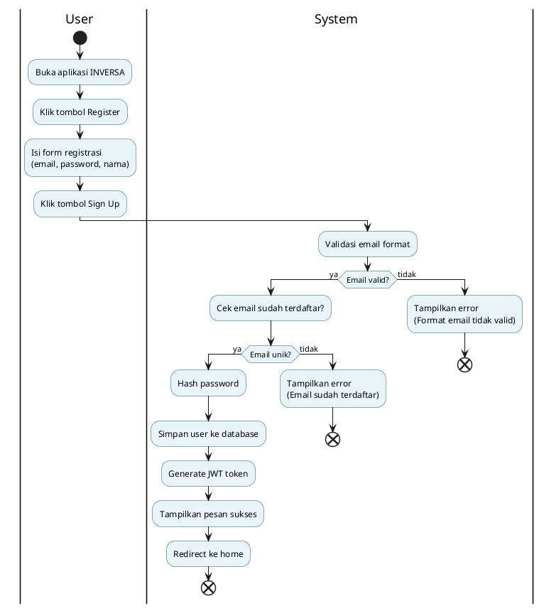
```plantuml
@startuml Registrasi_Activity
skinparam backgroundColor #FEFEFE
skinparam activityBackgroundColor #E8F4F8
skinparam activityBorderColor #1E5A7A
skinparam swimlaneWidth 300

|User|
start
:Buka aplikasi INVERSA;
:Klik tombol Register;
:Isi form registrasi
(email, password, nama);
:Klik tombol Sign Up;

|System|
:Validasi email format;
if (Email valid?) then (ya)
    :Cek email sudah terdaftar?;
    if (Email unik?) then (ya)
        :Hash password;
        :Simpan user ke database;
        :Generate JWT token;
        :Tampilkan pesan sukses;
        :Redirect ke home;
        end
    else (tidak)
        :Tampilkan error
        (Email sudah terdaftar);
        end
    endif
else (tidak)
    :Tampilkan error
    (Format email tidak valid);
    end
endif

@enduml
```

### Sequence Diagram - Registrasi

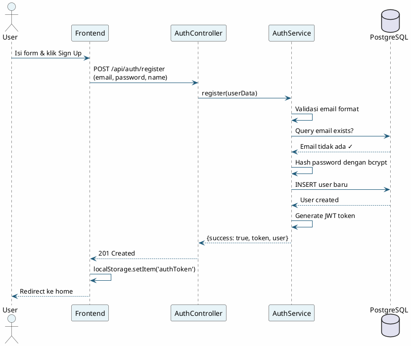
```plantuml
@startuml Registrasi_Sequence
!define ARROWCOLOR #1E5A7A
skinparam backgroundColor #FEFEFE
skinparam sequenceArrowColor ARROWCOLOR
skinparam actorBackgroundColor #E8F4F8
skinparam participantBackgroundColor #E8F4F8

actor User
participant "Frontend" as FE
participant "AuthController" as AC
participant "AuthService" as AS
database "PostgreSQL" as DB

User -> FE: Isi form & klik Sign Up
FE -> AC: POST /api/auth/register\n(email, password, name)
AC -> AS: register(userData)
AS -> AS: Validasi email format
AS -> DB: Query email exists?
DB --> AS: Email tidak ada ✓
AS -> AS: Hash password dengan bcrypt
AS -> DB: INSERT user baru
DB --> AS: User created
AS -> AS: Generate JWT token
AS --> AC: {success: true, token, user}
AC --> FE: 201 Created
FE -> FE: localStorage.setItem('authToken')
FE --> User: Redirect ke home

@enduml
```

---

## USE CASE 2: LOGIN (GUEST)

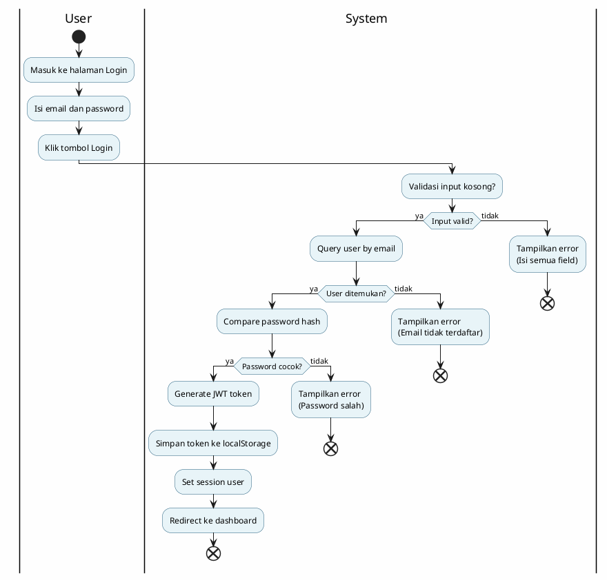
```plantuml
@startuml Login_Activity
skinparam backgroundColor #FEFEFE
skinparam activityBackgroundColor #E8F4F8
skinparam activityBorderColor #1E5A7A
skinparam swimlaneWidth 300

|User|
start
:Masuk ke halaman Login;
:Isi email dan password;
:Klik tombol Login;

|System|
:Validasi input kosong?;
if (Input valid?) then (ya)
    :Query user by email;
    if (User ditemukan?) then (ya)
        :Compare password hash;
        if (Password cocok?) then (ya)
            :Generate JWT token;
            :Simpan token ke localStorage;
            :Set session user;
            :Redirect ke dashboard;
            end
        else (tidak)
            :Tampilkan error
            (Password salah);
            end
        endif
    else (tidak)
        :Tampilkan error
        (Email tidak terdaftar);
        end
    endif
else (tidak)
    :Tampilkan error
    (Isi semua field);
    end
endif

@enduml
```

### Sequence Diagram - Login

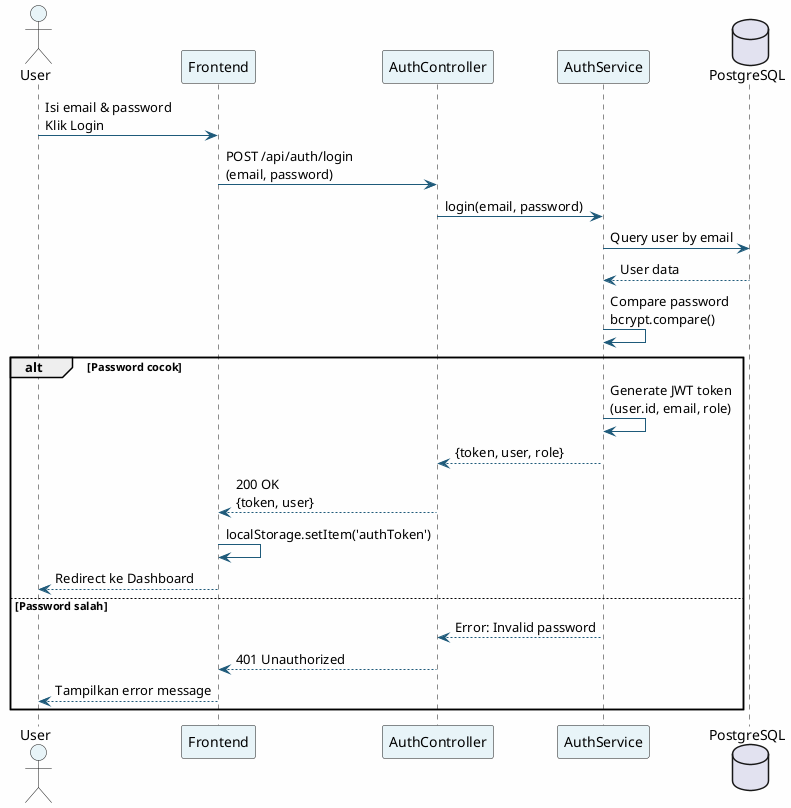
```plantuml
@startuml Login_Sequence
skinparam backgroundColor #FEFEFE
skinparam sequenceArrowColor #1E5A7A
skinparam actorBackgroundColor #E8F4F8
skinparam participantBackgroundColor #E8F4F8

actor User
participant "Frontend" as FE
participant "AuthController" as AC
participant "AuthService" as AS
database "PostgreSQL" as DB

User -> FE: Isi email & password\nKlik Login
FE -> AC: POST /api/auth/login\n(email, password)
AC -> AS: login(email, password)
AS -> DB: Query user by email
DB --> AS: User data
AS -> AS: Compare password\nbcrypt.compare()
alt Password cocok
    AS -> AS: Generate JWT token\n(user.id, email, role)
    AS --> AC: {token, user, role}
    AC --> FE: 200 OK\n{token, user}
    FE -> FE: localStorage.setItem('authToken')
    FE --> User: Redirect ke Dashboard
else Password salah
    AS --> AC: Error: Invalid password
    AC --> FE: 401 Unauthorized
    FE --> User: Tampilkan error message
end

@enduml
```

---

## GUEST & USER USE CASES - READING & EXPLORATION

## USE CASE 3: MEMBACA KARYA (GUEST/USER)

### Activity Diagram - Membuat Proyek Solo

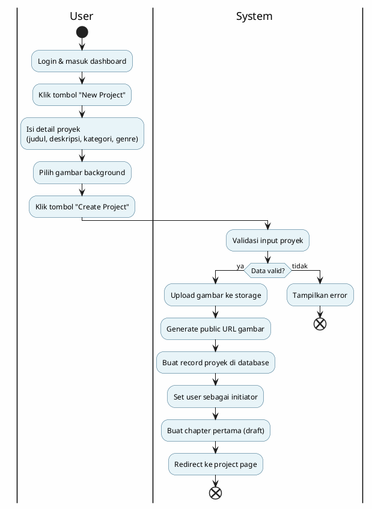
```plantuml
@startuml BuatProyek_Activity
skinparam backgroundColor #FEFEFE
skinparam activityBackgroundColor #E8F4F8
skinparam activityBorderColor #1E5A7A
skinparam swimlaneWidth 300

|User|
start
:Login & masuk dashboard;
:Klik tombol "New Project";
:Isi detail proyek
(judul, deskripsi, kategori, genre);
:Pilih gambar background;
:Klik tombol "Create Project";

|System|
:Validasi input proyek;
if (Data valid?) then (ya)
    :Upload gambar ke storage;
    :Generate public URL gambar;
    :Buat record proyek di database;
    :Set user sebagai initiator;
    :Buat chapter pertama (draft);
    :Redirect ke project page;
    end
else (tidak)
    :Tampilkan error;
    end
endif

@enduml
```

### Sequence Diagram - Membuat Proyek Solo

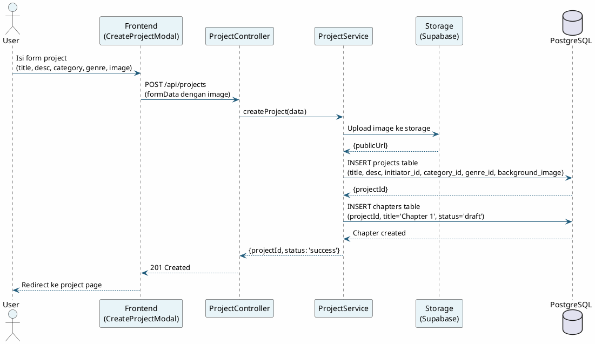
```plantuml
@startuml BuatProyek_Sequence
skinparam backgroundColor #FEFEFE
skinparam sequenceArrowColor #1E5A7A
skinparam actorBackgroundColor #E8F4F8
skinparam participantBackgroundColor #E8F4F8

actor User
participant "Frontend\n(CreateProjectModal)" as FE
participant "ProjectController" as PC
participant "ProjectService" as PS
participant "Storage\n(Supabase)" as ST
database "PostgreSQL" as DB

User -> FE: Isi form project\n(title, desc, category, genre, image)
FE -> PC: POST /api/projects\n(formData dengan image)
PC -> PS: createProject(data)
PS -> ST: Upload image ke storage
ST --> PS: {publicUrl}
PS -> DB: INSERT projects table\n(title, desc, initiator_id, category_id, genre_id, background_image)
DB --> PS: {projectId}
PS -> DB: INSERT chapters table\n(projectId, title='Chapter 1', status='draft')
DB --> PS: Chapter created
PS --> PC: {projectId, status: 'success'}
PC --> FE: 201 Created
FE --> User: Redirect ke project page

@enduml
```

---

## USE CASE 4: MENGIKUTI PROJECT (GUEST/USER)

### Activity Diagram - Mengikuti Project

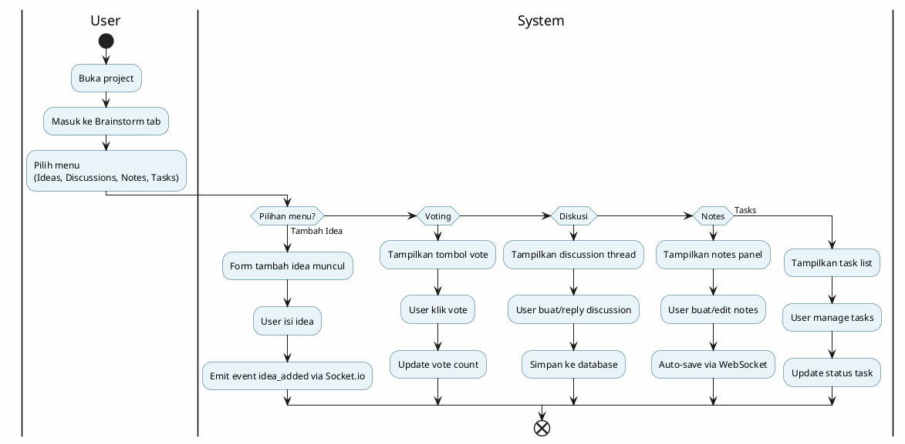
```plantuml
@startuml BrainStorm_Activity
skinparam backgroundColor #FEFEFE
skinparam activityBackgroundColor #E8F4F8
skinparam activityBorderColor #1E5A7A
skinparam swimlaneWidth 300

|User|
start
:Buka project;
:Masuk ke Brainstorm tab;
:Pilih menu
(Ideas, Discussions, Notes, Tasks);

|System|
if (Pilihan menu?) then (Tambah Idea)
    :Form tambah idea muncul;
    :User isi idea;
    :Emit event idea_added via Socket.io;
elseif (Voting) then
    :Tampilkan tombol vote;
    :User klik vote;
    :Update vote count;
elseif (Diskusi) then
    :Tampilkan discussion thread;
    :User buat/reply discussion;
    :Simpan ke database;
elseif (Notes) then
    :Tampilkan notes panel;
    :User buat/edit notes;
    :Auto-save via WebSocket;
else (Tasks)
    :Tampilkan task list;
    :User manage tasks;
    :Update status task;
endif
end

@enduml
```

### Sequence Diagram - Mengelola Brainstorming

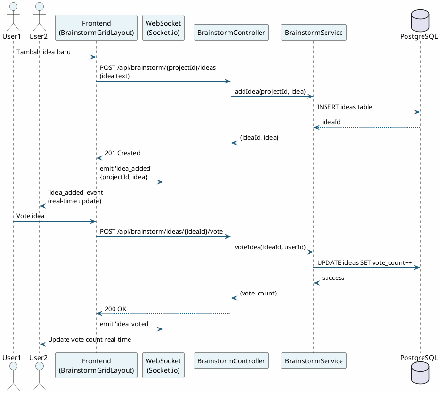
```plantuml
@startuml BrainStorm_Sequence
skinparam backgroundColor #FEFEFE
skinparam sequenceArrowColor #1E5A7A
skinparam actorBackgroundColor #E8F4F8
skinparam participantBackgroundColor #E8F4F8

actor User1
actor User2
participant "Frontend\n(BrainstormGridLayout)" as FE
participant "WebSocket\n(Socket.io)" as WS
participant "BrainstormController" as BC
participant "BrainstormService" as BS
database "PostgreSQL" as DB

User1 -> FE: Tambah idea baru
FE -> BC: POST /api/brainstorm/{projectId}/ideas\n(idea text)
BC -> BS: addIdea(projectId, idea)
BS -> DB: INSERT ideas table
DB --> BS: ideaId
BS --> BC: {ideaId, idea}
BC --> FE: 201 Created
FE -> WS: emit 'idea_added'\n{projectId, idea}
WS --> User2: 'idea_added' event\n(real-time update)

User1 -> FE: Vote idea
FE -> BC: POST /api/brainstorm/ideas/{ideaId}/vote
BC -> BS: voteIdea(ideaId, userId)
BS -> DB: UPDATE ideas SET vote_count++
DB --> BS: success
BS --> BC: {vote_count}
BC --> FE: 200 OK
FE -> WS: emit 'idea_voted'
WS --> User2: Update vote count real-time

@enduml
```

---

## USE CASE 5: MENCARI KARYA (GUEST/USER)

### Activity Diagram - Mencari Karya

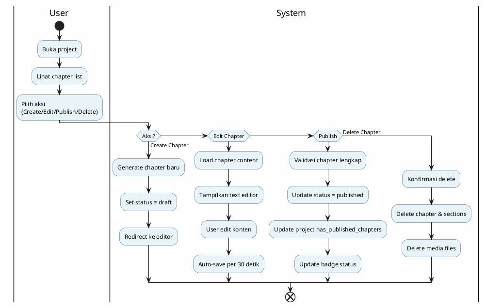
```plantuml
@startuml Chapter_Activity
skinparam backgroundColor #FEFEFE
skinparam activityBackgroundColor #E8F4F8
skinparam activityBorderColor #1E5A7A
skinparam swimlaneWidth 300

|User|
start
:Buka project;
:Lihat chapter list;
:Pilih aksi
(Create/Edit/Publish/Delete);

|System|
if (Aksi?) then (Create Chapter)
    :Generate chapter baru;
    :Set status = draft;
    :Redirect ke editor;
elseif (Edit Chapter) then
    :Load chapter content;
    :Tampilkan text editor;
    :User edit konten;
    :Auto-save per 30 detik;
elseif (Publish) then
    :Validasi chapter lengkap;
    :Update status = published;
    :Update project has_published_chapters;
    :Update badge status;
else (Delete Chapter)
    :Konfirmasi delete;
    :Delete chapter & sections;
    :Delete media files;
endif
end

@enduml
```

### Sequence Diagram - Mengelola Text Cell

---

## USE CASE 6: MEMBERIKAN LIKE & KOMENTAR (GUEST/USER)

### Activity Diagram - Like & Komentar

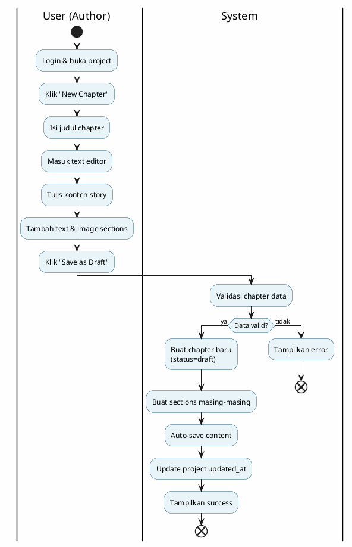
```plantuml
@startuml BuatKarya_Activity
skinparam backgroundColor #FEFEFE
skinparam activityBackgroundColor #E8F4F8
skinparam activityBorderColor #1E5A7A
skinparam swimlaneWidth 300

|User (Author)|
start
:Login & buka project;
:Klik "New Chapter";
:Isi judul chapter;
:Masuk text editor;
:Tulis konten story;
:Tambah text & image sections;
:Klik "Save as Draft";

|System|
:Validasi chapter data;
if (Data valid?) then (ya)
    :Buat chapter baru
    (status=draft);
    :Buat sections masing-masing;
    :Auto-save content;
    :Update project updated_at;
    :Tampilkan success;
    end
else (tidak)
    :Tampilkan error;
    end
endif

@enduml
```

### Sequence Diagram - Membuat Karya

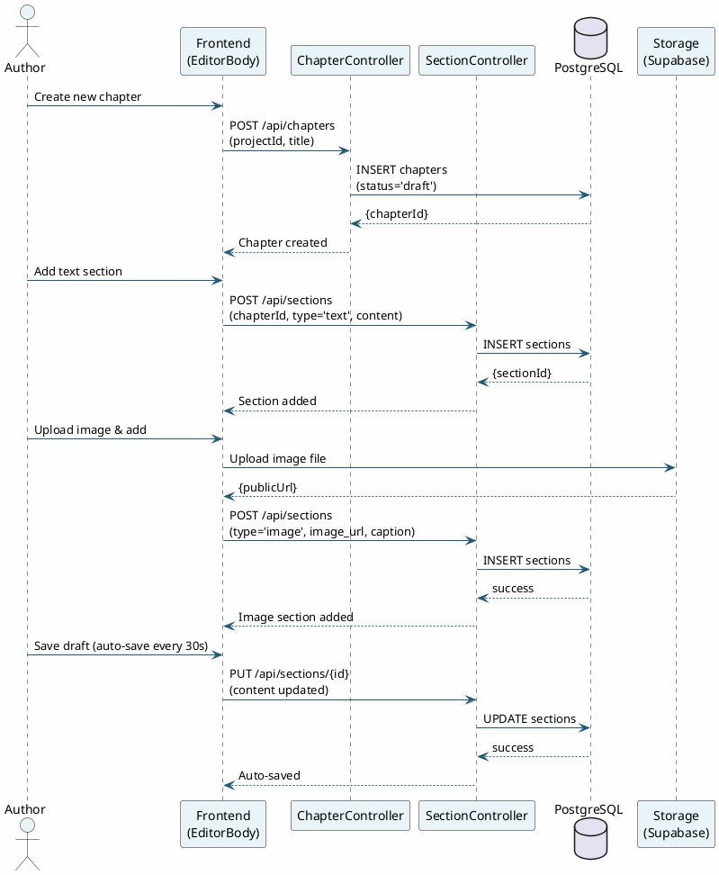
```plantuml
@startuml BuatKarya_Sequence
skinparam backgroundColor #FEFEFE
skinparam sequenceArrowColor #1E5A7A
skinparam actorBackgroundColor #E8F4F8
skinparam participantBackgroundColor #E8F4F8

actor Author
participant "Frontend\n(EditorBody)" as FE
participant "ChapterController" as CC
participant "SectionController" as SC
database "PostgreSQL" as DB
participant "Storage\n(Supabase)" as ST

Author -> FE: Create new chapter
FE -> CC: POST /api/chapters\n(projectId, title)
CC -> DB: INSERT chapters\n(status='draft')
DB --> CC: {chapterId}
CC --> FE: Chapter created

Author -> FE: Add text section
FE -> SC: POST /api/sections\n(chapterId, type='text', content)
SC -> DB: INSERT sections
DB --> SC: {sectionId}
SC --> FE: Section added

Author -> FE: Upload image & add
FE -> ST: Upload image file
ST --> FE: {publicUrl}
FE -> SC: POST /api/sections\n(type='image', image_url, caption)
SC -> DB: INSERT sections
DB --> SC: success
SC --> FE: Image section added

Author -> FE: Save draft (auto-save every 30s)
FE -> SC: PUT /api/sections/{id}\n(content updated)
SC -> DB: UPDATE sections
DB --> SC: success
SC --> FE: Auto-saved

@enduml
```

---

## USE CASE 7: MELAPORKAN KONTEN (GUEST/USER)

### Activity Diagram - Melaporkan Konten

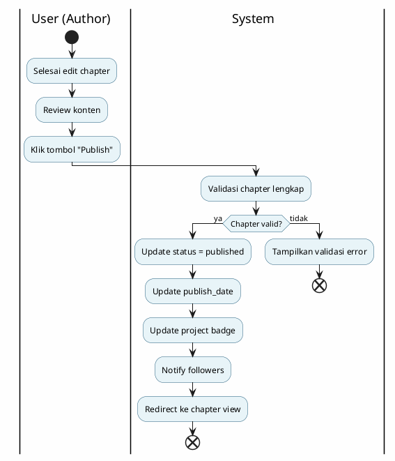
```plantuml
@startuml PublishKarya_Activity
skinparam backgroundColor #FEFEFE
skinparam activityBackgroundColor #E8F4F8
skinparam activityBorderColor #1E5A7A
skinparam swimlaneWidth 300

|User (Author)|
start
:Selesai edit chapter;
:Review konten;
:Klik tombol "Publish";

|System|
:Validasi chapter lengkap;
if (Chapter valid?) then (ya)
    :Update status = published;
    :Update publish_date;
    :Update project badge;
    :Notify followers;
    :Redirect ke chapter view;
    end
else (tidak)
    :Tampilkan validasi error;
    end
endif

@enduml
```

### Sequence Diagram - Publish Karya

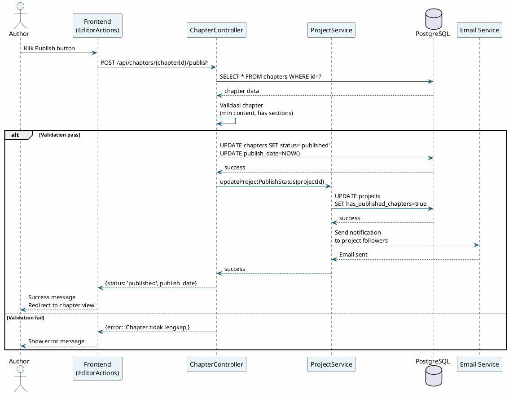
```plantuml
@startuml PublishKarya_Sequence
skinparam backgroundColor #FEFEFE
skinparam sequenceArrowColor #1E5A7A
skinparam actorBackgroundColor #E8F4F8
skinparam participantBackgroundColor #E8F4F8

actor Author
participant "Frontend\n(EditorActions)" as FE
participant "ChapterController" as CC
participant "ProjectService" as PS
database "PostgreSQL" as DB
participant "Email Service" as ES

Author -> FE: Klik Publish button
FE -> CC: POST /api/chapters/{chapterId}/publish
CC -> DB: SELECT * FROM chapters WHERE id=?
DB --> CC: chapter data
CC -> CC: Validasi chapter\n(min content, has sections)

alt Validation pass
    CC -> DB: UPDATE chapters SET status='published'\nUPDATE publish_date=NOW()
    DB --> CC: success
    CC -> PS: updateProjectPublishStatus(projectId)
    PS -> DB: UPDATE projects\nSET has_published_chapters=true
    DB --> PS: success
    PS -> ES: Send notification\nto project followers
    ES --> PS: Email sent
    PS --> CC: success
    CC --> FE: {status: 'published', publish_date}
    FE --> Author: Success message\nRedirect to chapter view
else Validation fail
    CC --> FE: {error: 'Chapter tidak lengkap'}
    FE --> Author: Show error message
end

@enduml
```

---

## USER (LOGGED IN) USE CASES - PROJECT CREATION & COLLABORATION

## USE CASE 8: MEMBUAT PROYEK SOLO (USER)

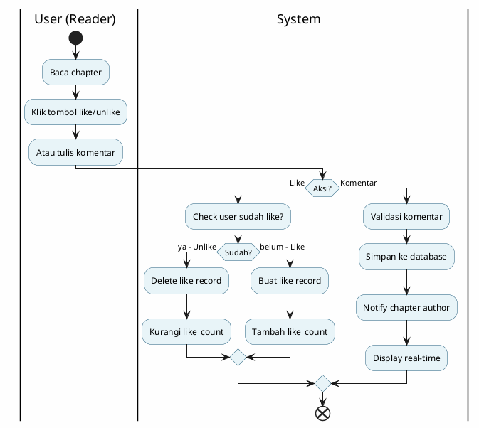
```plantuml
@startuml LikeKomentar_Activity
skinparam backgroundColor #FEFEFE
skinparam activityBackgroundColor #E8F4F8
skinparam activityBorderColor #1E5A7A
skinparam swimlaneWidth 300

|User (Reader)|
start
:Baca chapter;
:Klik tombol like/unlike;
:Atau tulis komentar;

|System|
if (Aksi?) then (Like)
    :Check user sudah like?;
    if (Sudah?) then (ya - Unlike)
        :Delete like record;
        :Kurangi like_count;
    else (belum - Like)
        :Buat like record;
        :Tambah like_count;
    endif
else (Komentar)
    :Validasi komentar;
    :Simpan ke database;
    :Notify chapter author;
    :Display real-time;
endif
end

@enduml
```

### Sequence Diagram - Like & Komentar

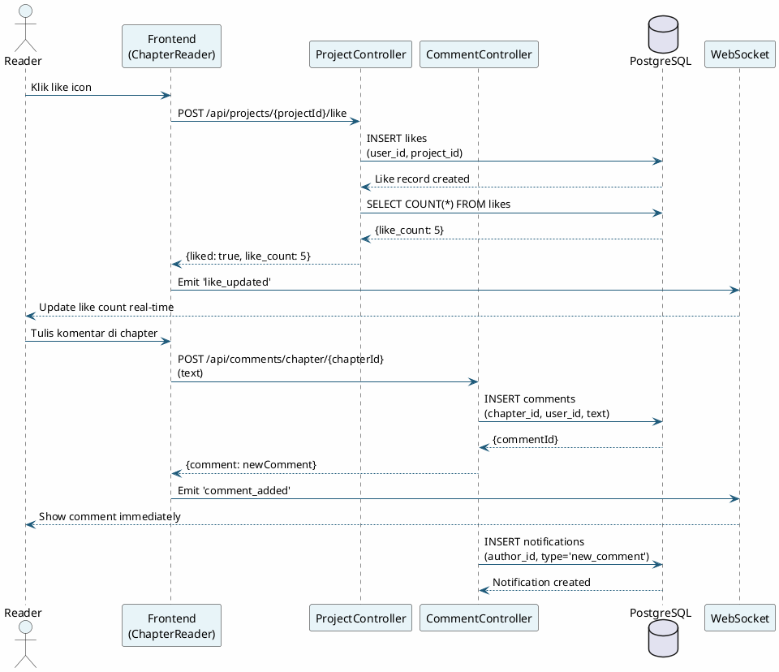
```plantuml
@startuml LikeKomentar_Sequence
skinparam backgroundColor #FEFEFE
skinparam sequenceArrowColor #1E5A7A
skinparam actorBackgroundColor #E8F4F8
skinparam participantBackgroundColor #E8F4F8

actor Reader
participant "Frontend\n(ChapterReader)" as FE
participant "ProjectController" as PC
participant "CommentController" as CC
database "PostgreSQL" as DB
participant "WebSocket" as WS

Reader -> FE: Klik like icon
FE -> PC: POST /api/projects/{projectId}/like
PC -> DB: INSERT likes\n(user_id, project_id)
DB --> PC: Like record created
PC -> DB: SELECT COUNT(*) FROM likes
DB --> PC: {like_count: 5}
PC --> FE: {liked: true, like_count: 5}
FE -> WS: Emit 'like_updated'
WS --> Reader: Update like count real-time

Reader -> FE: Tulis komentar di chapter
FE -> CC: POST /api/comments/chapter/{chapterId}\n(text)
CC -> DB: INSERT comments\n(chapter_id, user_id, text)
DB --> CC: {commentId}
CC --> FE: {comment: newComment}
FE -> WS: Emit 'comment_added'
WS --> Reader: Show comment immediately
CC -> DB: INSERT notifications\n(author_id, type='new_comment')
DB --> CC: Notification created

@enduml
```

---

## USE CASE 9: MEMBUAT PROYEK TIM (USER - TEAM LEAD)

### Activity Diagram - Membuat Proyek Tim

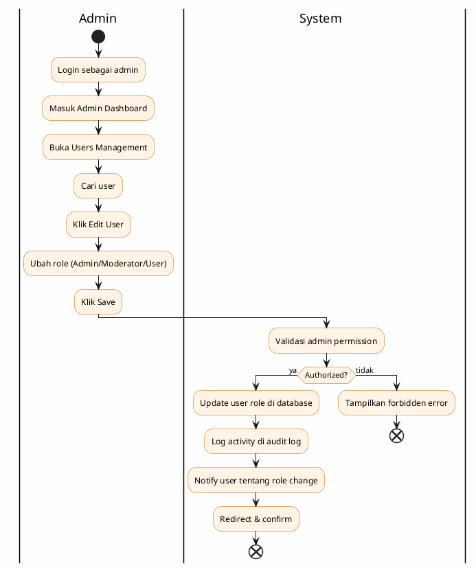
```plantuml
@startuml ManageRole_Activity
skinparam backgroundColor #FEFEFE
skinparam activityBackgroundColor #FFF4E6
skinparam activityBorderColor #C65D00
skinparam swimlaneWidth 300

|Admin|
start
:Login sebagai admin;
:Masuk Admin Dashboard;
:Buka Users Management;
:Cari user;
:Klik Edit User;
:Ubah role (Admin/Moderator/User);
:Klik Save;

|System|
:Validasi admin permission;
if (Authorized?) then (ya)
    :Update user role di database;
    :Log activity di audit log;
    :Notify user tentang role change;
    :Redirect & confirm;
    end
else (tidak)
    :Tampilkan forbidden error;
    end
endif

@enduml
```

### Sequence Diagram - Mengelola Role Anggota

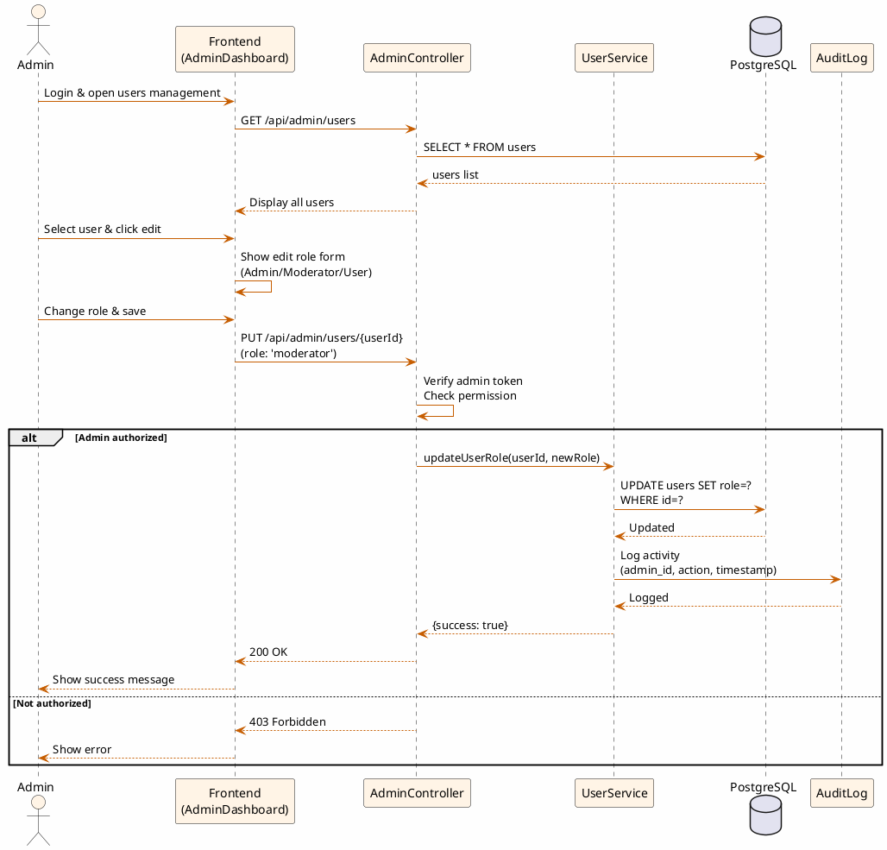
```plantuml
@startuml ManageRole_Sequence
skinparam backgroundColor #FEFEFE
skinparam sequenceArrowColor #C65D00
skinparam actorBackgroundColor #FFF4E6
skinparam participantBackgroundColor #FFF4E6

actor Admin
participant "Frontend\n(AdminDashboard)" as FE
participant "AdminController" as AC
participant "UserService" as US
database "PostgreSQL" as DB
participant "AuditLog" as AL

Admin -> FE: Login & open users management
FE -> AC: GET /api/admin/users
AC -> DB: SELECT * FROM users
DB --> AC: users list
AC --> FE: Display all users

Admin -> FE: Select user & click edit
FE -> FE: Show edit role form\n(Admin/Moderator/User)

Admin -> FE: Change role & save
FE -> AC: PUT /api/admin/users/{userId}\n(role: 'moderator')
AC -> AC: Verify admin token\nCheck permission
alt Admin authorized
    AC -> US: updateUserRole(userId, newRole)
    US -> DB: UPDATE users SET role=?\nWHERE id=?
    DB --> US: Updated
    US -> AL: Log activity\n(admin_id, action, timestamp)
    AL --> US: Logged
    US --> AC: {success: true}
    AC --> FE: 200 OK
    FE --> Admin: Show success message
else Not authorized
    AC --> FE: 403 Forbidden
    FE --> Admin: Show error
end

@enduml
```

---

## USE CASE 10: MENGELOLA BRAINSTORMING (USER) - PARENT USE CASE
## Includes: Tambah Idea, Voting Story Ideas, Diskusi, Mengelola Notes

### Activity Diagram - Mengelola Brainstorming (Main Flow)

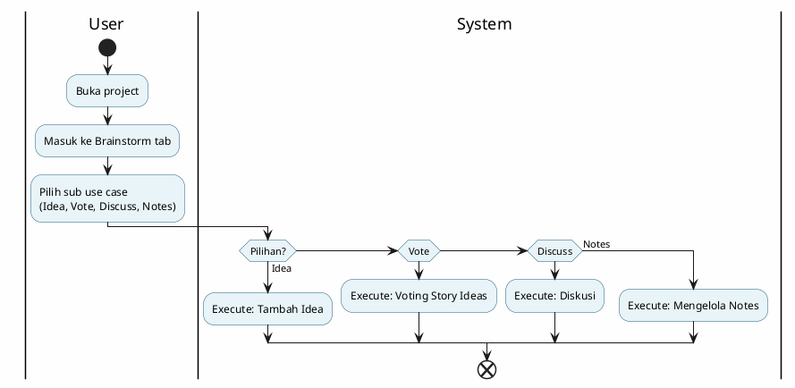
```plantuml
@startuml BrainStorm_Activity
skinparam backgroundColor #FEFEFE
skinparam activityBackgroundColor #E8F4F8
skinparam activityBorderColor #1E5A7A
skinparam swimlaneWidth 300

|User|
start
:Buka project;
:Masuk ke Brainstorm tab;
:Pilih sub use case
(Idea, Vote, Discuss, Notes);

|System|
if (Pilihan?) then (Idea)
    :Execute: Tambah Idea;
elseif (Vote) then
    :Execute: Voting Story Ideas;
elseif (Discuss) then
    :Execute: Diskusi;
else (Notes)
    :Execute: Mengelola Notes;
endif
end

@enduml
```

### Sequence Diagram - Mengelola Brainstorming (Main Flow)

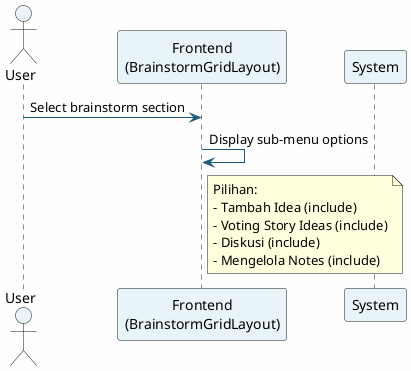
```plantuml
@startuml BrainStorm_Sequence
skinparam backgroundColor #FEFEFE
skinparam sequenceArrowColor #1E5A7A
skinparam actorBackgroundColor #E8F4F8
skinparam participantBackgroundColor #E8F4F8

actor User
participant "Frontend\n(BrainstormGridLayout)" as FE
participant "System" as SYS

User -> FE: Select brainstorm section
FE -> FE: Display sub-menu options

note right of FE
Pilihan:
- Tambah Idea (include)
- Voting Story Ideas (include)
- Diskusi (include)
- Mengelola Notes (include)
end note

@enduml
```

---

## USE CASE 10.1: TAMBAH IDEA (INCLUDED IN BRAINSTORMING)

### Activity Diagram - Tambah Idea

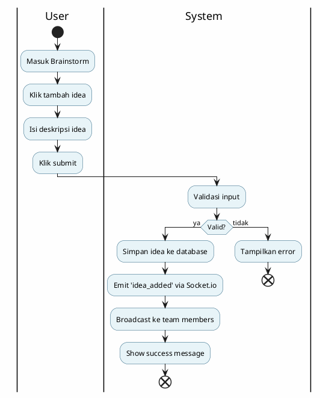
```plantuml
@startuml AddIdea_Activity
skinparam backgroundColor #FEFEFE
skinparam activityBackgroundColor #E8F4F8
skinparam activityBorderColor #1E5A7A
skinparam swimlaneWidth 300

|User|
start
:Masuk Brainstorm;
:Klik tambah idea;
:Isi deskripsi idea;
:Klik submit;

|System|
:Validasi input;
if (Valid?) then (ya)
    :Simpan idea ke database;
    :Emit 'idea_added' via Socket.io;
    :Broadcast ke team members;
    :Show success message;
    end
else (tidak)
    :Tampilkan error;
    end
endif

@enduml
```

### Sequence Diagram - Tambah Idea

```plantuml
@startuml AddIdea_Sequence
skinparam backgroundColor #FEFEFE
skinparam sequenceArrowColor #1E5A7A
skinparam actorBackgroundColor #E8F4F8
skinparam participantBackgroundColor #E8F4F8

actor User1
actor User2
participant "Frontend" as FE
participant "BrainstormController" as BC
participant "BrainstormService" as BS
database "PostgreSQL" as DB
participant "WebSocket" as WS

User1 -> FE: Fill idea & click submit
FE -> BC: POST /api/brainstorm/{projectId}/ideas\n(idea_text)
BC -> BS: addIdea(projectId, userId, idea)
BS -> DB: INSERT ideas table
DB --> BS: {ideaId}
BS --> BC: {ideaId, idea}
BC --> FE: 201 Created
FE -> WS: emit 'idea_added'
WS --> User2: Real-time update

@enduml
```

---

## USE CASE 10.2: VOTING STORY IDEAS (INCLUDED IN BRAINSTORMING)

### Activity Diagram - Voting Story Ideas

```plantuml
@startuml VotingIdea_Activity
skinparam backgroundColor #FEFEFE
skinparam activityBackgroundColor #E8F4F8
skinparam activityBorderColor #1E5A7A
skinparam swimlaneWidth 300

|User|
start
:Masuk Brainstorm;
:Lihat daftar ideas;
:Klik tombol vote pada idea;

|System|
:Check user sudah vote?;
if (Vote exists?) then (ya - unvote)
    :Delete vote record;
    :Update vote_count--;
    :Emit update real-time;
else (belum - vote)
    :Insert vote record;
    :Update vote_count++;
    :Emit update real-time;
endif
end

@enduml
```

### Sequence Diagram - Voting Story Ideas

```plantuml
@startuml VotingIdea_Sequence
skinparam backgroundColor #FEFEFE
skinparam sequenceArrowColor #1E5A7A
skinparam actorBackgroundColor #E8F4F8
skinparam participantBackgroundColor #E8F4F8

actor User1
actor User2
participant "Frontend" as FE
participant "BrainstormController" as BC
participant "BrainstormService" as BS
database "PostgreSQL" as DB
participant "WebSocket" as WS

User1 -> FE: Click vote button on idea
FE -> BC: POST /api/brainstorm/ideas/{ideaId}/vote
BC -> BS: toggleVote(ideaId, userId)
BS -> DB: Check vote exists
DB --> BS: vote data or null

alt Vote exists
    BS -> DB: DELETE FROM votes
    DB --> BS: Deleted
    BS -> DB: UPDATE ideas SET vote_count--
else No vote yet
    BS -> DB: INSERT votes
    DB --> BS: Vote created
    BS -> DB: UPDATE ideas SET vote_count++
end

BS --> BC: {vote_count}
BC --> FE: 200 OK
FE -> WS: emit 'idea_voted'
WS --> User2: Update vote count

@enduml
```

---

## USE CASE 10.3: DISKUSI (INCLUDED IN BRAINSTORMING)

### Activity Diagram - Diskusi

```plantuml
@startuml Discussion_Activity
skinparam backgroundColor #FEFEFE
skinparam activityBackgroundColor #E8F4F8
skinparam activityBorderColor #1E5A7A
skinparam swimlaneWidth 300

|User|
start
:Masuk Brainstorm;
:Buka Discussion panel;
:Baca/buat diskusi;
:Reply atau komentar;

|System|
:Load discussion threads;
:Display existing discussions;
:Accept user input;
:Validasi komentar;
if (Valid?) then (ya)
    :Simpan ke database;
    :Emit real-time update;
    :Notify participants;
else (tidak)
    :Show error;
endif

@enduml
```

### Sequence Diagram - Diskusi

```plantuml
@startuml Discussion_Sequence
skinparam backgroundColor #FEFEFE
skinparam sequenceArrowColor #1E5A7A
skinparam actorBackgroundColor #E8F4F8
skinparam participantBackgroundColor #E8F4F8

actor User1
actor User2
participant "Frontend" as FE
participant "DiscussionController" as DC
participant "DiscussionService" as DS
database "PostgreSQL" as DB
participant "WebSocket" as WS

User1 -> FE: Click discussion panel
FE -> DC: GET /api/brainstorm/{projectId}/discussions
DC -> DB: SELECT * FROM discussions\nWHERE project_id=?\nORDER BY created_at DESC
DB --> DC: discussions list
DC --> FE: Display discussions

User1 -> FE: Write reply/comment
FE -> DC: POST /api/discussions/{threadId}/reply\n(text)
DC -> DS: addReply(threadId, userId, text)
DS -> DB: INSERT discussion_replies
DB --> DS: reply created
DS --> DC: {replyId, reply}
DC --> FE: 201 Created
FE -> WS: emit 'discussion_replied'
WS --> User2: Show new reply

@enduml
```

---

## USE CASE 10.4: MENGELOLA NOTES (INCLUDED IN BRAINSTORMING)

### Activity Diagram - Mengelola Notes

```plantuml
@startuml ManageNotes_Activity
skinparam backgroundColor #FEFEFE
skinparam activityBackgroundColor #E8F4F8
skinparam activityBorderColor #1E5A7A
skinparam swimlaneWidth 300

|User|
start
:Masuk Brainstorm;
:Buka Notes panel;
:Baca notes yang ada;
:Buat atau edit notes;
:Auto-save;

|System|
:Load notes list;
:Accept text input;
:Auto-save per keystroke;
:Emit real-time update;
:Notify team members;
:Show save indicator;

@enduml
```

### Sequence Diagram - Mengelola Notes

```plantuml
@startuml ManageNotes_Sequence
skinparam backgroundColor #FEFEFE
skinparam sequenceArrowColor #1E5A7A
skinparam actorBackgroundColor #E8F4F8
skinparam participantBackgroundColor #E8F4F8

actor User
participant "Frontend" as FE
participant "NotesController" as NC
participant "NotesService" as NS
database "PostgreSQL" as DB
participant "WebSocket" as WS

User -> FE: Click Notes panel
FE -> NC: GET /api/brainstorm/{projectId}/notes
NC -> DB: SELECT * FROM notes\nWHERE project_id=?
DB --> NC: notes list
NC --> FE: Display notes

User -> FE: Edit notes (auto-save every 2s)
FE -> NC: PUT /api/notes/{noteId}\n(content)
NC -> NS: updateNote(noteId, content)
NS -> DB: UPDATE notes SET content=?
DB --> NS: Updated
NS --> NC: {noteId, updatedAt}
NC --> FE: 200 OK
FE -> WS: emit 'note_updated'
WS --> FE: Show 'Saved at X'

@enduml
```

---

## USE CASE 11: MENGELOLA CHAPTER (USER) - PARENT USE CASE
## Includes: Mengelola Text Cell, Mengelola Image Cell

### Activity Diagram - Mengelola Chapter (Main Flow)

```plantuml
@startuml Chapter_Activity
skinparam backgroundColor #FEFEFE
skinparam activityBackgroundColor #E8F4F8
skinparam activityBorderColor #1E5A7A
skinparam swimlaneWidth 300

|User|
start
:Buka project;
:Lihat chapter list;
:Pilih chapter;
:Edit chapter content;

|System|
:Load chapter data;
if (Aksi?) then (Edit Text)
    :Execute: Mengelola Text Cell;
elseif (Edit Image) then
    :Execute: Mengelola Image Cell;
elseif (Save) then
    :Auto-save content;
elseif (Publish) then
    :Validate & publish;
else (Delete)
    :Delete chapter;
endif
end

@enduml
```

### Sequence Diagram - Mengelola Chapter (Main Flow)

```plantuml
@startuml Chapter_Sequence
skinparam backgroundColor #FEFEFE
skinparam sequenceArrowColor #1E5A7A
skinparam actorBackgroundColor #E8F4F8
skinparam participantBackgroundColor #E8F4F8

actor User
participant "Frontend\n(EditorPage)" as FE
participant "ChapterController" as CC
participant "System" as SYS

User -> FE: Open chapter for editing
FE -> CC: GET /api/chapters/{chapterId}
CC --> FE: Chapter with sections

note right of FE
Sub use cases (included):
- Mengelola Text Cell
- Mengelola Image Cell
- Auto-save
- Publish chapter
end note

@enduml
```

---

## USE CASE 11.1: MENGELOLA TEXT CELL (INCLUDED IN CHAPTER)

### Activity Diagram - Mengelola Text Cell

```plantuml
@startuml Dashboard_Activity
skinparam backgroundColor #FEFEFE
skinparam activityBackgroundColor #FFF4E6
skinparam activityBorderColor #C65D00
skinparam swimlaneWidth 300

|Admin|
start
:Login & buka dashboard;
:Dashboard load statistics;
:Buka menu laporan;
:Pilih report type
(Users, Projects, Reports);

|System|
:Fetch data dari database;
if (Report type?) then (Users)
    :Count total users;
    :Group by role;
    :Tampilkan chart;
elseif (Projects) then
    :Count projects;
    :Group by status;
    :Hitung total chapters;
else (Reports)
    :Fetch user reports;
    :Tampilkan pending reports;
    :Show action buttons;
endif
end

@enduml
```

### Sequence Diagram - Melihat Dashboard & Laporan

```plantuml
@startuml Dashboard_Sequence
skinparam backgroundColor #FEFEFE
skinparam sequenceArrowColor #C65D00
skinparam actorBackgroundColor #FFF4E6
skinparam participantBackgroundColor #FFF4E6

actor Admin
participant "Frontend\n(AdminDashboard)" as FE
participant "AdminController" as AC
participant "ReportService" as RS
database "PostgreSQL" as DB

Admin -> FE: Login & open admin dashboard
FE -> AC: GET /api/admin/dashboard
AC -> DB: SELECT COUNT(*) FROM users
DB --> AC: {totalUsers: 150}
AC -> DB: SELECT COUNT(*) FROM projects
DB --> AC: {totalProjects: 45}
AC -> DB: SELECT COUNT(*) FROM chapters\nWHERE status='published'
DB --> AC: {publishedChapters: 120}
AC --> FE: Dashboard data\n{stats}
FE --> Admin: Display dashboard\nwith charts & stats

Admin -> FE: Click view reports
FE -> AC: GET /api/admin/reports
AC -> RS: getReports(status='pending')
RS -> DB: SELECT * FROM reports\nWHERE status='pending'
DB --> RS: reports list
RS --> AC: {reports: [...]}
AC --> FE: {reports}
FE --> Admin: Display reports table\nwith pending reports

Admin -> FE: Click on report\nto view details
FE -> AC: GET /api/admin/reports/{reportId}
AC -> DB: SELECT * FROM reports\nJOIN users, projects...
DB --> AC: Full report details
AC --> FE: Report details
FE --> Admin: Show report context\n& action buttons

@enduml
```

```plantuml
@startuml ManageTeksel_Sequence
skinparam backgroundColor #FEFEFE
skinparam sequenceArrowColor #1E5A7A
skinparam actorBackgroundColor #E8F4F8
skinparam participantBackgroundColor #E8F4F8

actor TeamMember
participant "Frontend\n(TextEditorSection)" as FE
participant "SectionController" as SC
participant "WebSocket" as WS
database "PostgreSQL" as DB

TeamMember -> FE: Click edit text section
FE -> SC: POST /api/sections/{sectionId}/lock
SC -> DB: UPDATE sections\nSET locked_by=user_id, locked_at=NOW()
DB --> SC: Locked
SC -> WS: Emit 'section_locked'
WS --> TeamMember: Show locked indicator

FE --> TeamMember: Show text editor\nwith formatting toolbar

TeamMember -> FE: Type/edit text\nadd formatting
FE -> FE: Auto-save on change\n(debounce 2s)

FE -> SC: PUT /api/sections/{sectionId}\n(content with formatting)
SC -> DB: UPDATE sections\nSET content=?, updated_at=NOW()
DB --> SC: Updated
SC -> WS: Emit 'section_updated'\n(content, user_id)
WS --> TeamMember: Live preview\nfor other team members

TeamMember -> FE: Done editing\nClick Save
FE -> SC: POST /api/sections/{sectionId}/unlock
SC -> DB: UPDATE sections\nSET locked_by=NULL, locked_at=NULL
DB --> SC: Unlocked
SC -> WS: Emit 'section_unlocked'
WS --> TeamMember: Section unlocked\nothers can now edit

@enduml
```

---

## USE CASE 11.2: MENGELOLA IMAGE CELL (INCLUDED IN CHAPTER)

### Activity Diagram - Mengelola Image Cell

```plantuml
@startuml ManageImageCell_Activity
skinparam backgroundColor #FEFEFE
skinparam activityBackgroundColor #E8F4F8
skinparam activityBorderColor #1E5A7A
skinparam swimlaneWidth 300

|User (Team Member)|
start
:Buka chapter editor;
:Click tombol edit image section;
:Upload image atau pilih URL;
:Isi caption;
:Resize/crop (optional);
:Simpan;

|System|
:Lock section;
:Validate image;
:Upload ke Supabase storage;
:Generate public URL;
:Compress & resize image;
:Simpan metadata;
:Emit real-time update;
:Unlock section;

@enduml
```

### Sequence Diagram - Mengelola Image Cell

```plantuml
@startuml ManageImageCell_Sequence
skinparam backgroundColor #FEFEFE
skinparam sequenceArrowColor #1E5A7A
skinparam actorBackgroundColor #E8F4F8
skinparam participantBackgroundColor #E8F4F8

actor TeamMember
participant "Frontend\n(ImageSection)" as FE
participant "SectionController" as SC
participant "Storage\n(Supabase)" as ST
participant "WebSocket" as WS
database "PostgreSQL" as DB

TeamMember -> FE: Click edit image section
FE -> SC: POST /api/sections/{sectionId}/lock
SC -> DB: UPDATE sections SET locked_by=user_id
DB --> SC: Locked
SC -> WS: Emit 'section_locked'
WS --> TeamMember: Section locked

TeamMember -> FE: Select image file
FE -> FE: Validate image format\n(jpg, png, webp)

FE -> ST: Upload image\nmultipart/form-data
ST -> ST: Auto-resize & compress\n(optimize for web)
ST --> FE: {publicUrl, size}

TeamMember -> FE: Add caption\nClick Save
FE -> SC: PUT /api/sections/{sectionId}\n(image_url, caption)
SC -> DB: UPDATE sections\nSET image_url=?, caption=?, updated_at=NOW()
DB --> SC: Updated

SC -> WS: Emit 'section_updated'\n(image_url, caption)
WS --> TeamMember: Real-time display\nfor other members

SC -> SC: Unlock section
SC -> DB: UPDATE sections SET locked_by=NULL
DB --> SC: Unlocked
SC -> WS: Emit 'section_unlocked'
WS --> TeamMember: Image section unlocked

@enduml
```

---

## USE CASE 12: MENYIMPAN DRAFT (USER)

### Activity Diagram - Menyimpan Draft

```plantuml
@startuml SaveDraft_Activity
skinparam backgroundColor #FEFEFE
skinparam activityBackgroundColor #E8F4F8
skinparam activityBorderColor #1E5A7A
skinparam swimlaneWidth 300

|User (Author)|
start
:Menulis konten chapter;
:Tekan Ctrl+S atau klik Save;

|System|
:Ambil draft content;
:Compress data;
:Send ke backend;
if (Save success?) then (ya)
    :Update modified timestamp;
    :Show save indicator;
    :Auto-save every 30s;
    end
else (tidak)
    :Retry dengan exponential backoff;
    :Show error notification;
    end
endif

@enduml
```

### Sequence Diagram - Menyimpan Draft

```plantuml
@startuml SaveDraft_Sequence
skinparam backgroundColor #FEFEFE
skinparam sequenceArrowColor #1E5A7A
skinparam actorBackgroundColor #E8F4F8
skinparam participantBackgroundColor #E8F4F8

actor Author
participant "Frontend\n(TextEditorSection)" as FE
participant "SectionController" as SC
participant "Cache\n(localStorage)" as CA
database "PostgreSQL" as DB

Author -> FE: Edit text & save\n(manual or auto-save)
FE -> CA: Save to localStorage\n(offline backup)
CA --> FE: Cached locally

FE -> SC: PUT /api/sections/{sectionId}\n(content, updated_at)
SC -> DB: UPDATE sections\nSET content=?, updated_at=NOW()

alt Save success
    DB --> SC: Updated
    SC --> FE: 200 OK\n{updatedAt}
    FE -> FE: Show save indicator\n'Saved at 10:30 PM'
    FE -> CA: Clear localStorage\n(backup not needed)
    CA --> FE: Cleared
else Save failed
    DB --> SC: Error
    SC --> FE: 500 Error
    FE -> FE: Show error\nKeep in localStorage
    FE -> FE: Retry after 5s\n(exponential backoff)
end

@enduml
```

---

## USE CASE 13: PUBLISH KARYA (USER - AUTHOR)

### Activity Diagram - Publish Karya

```plantuml
@startuml PublishKarya_Activity
skinparam backgroundColor #FEFEFE
skinparam activityBackgroundColor #E8F4F8
skinparam activityBorderColor #1E5A7A
skinparam swimlaneWidth 300

|User (Author)|
start
:Selesai edit chapter;
:Review konten;
:Klik tombol "Publish";

|System|
:Validasi chapter lengkap;
if (Chapter valid?) then (ya)
    :Update status = published;
    :Update publish_date;
    :Update project badge;
    :Notify followers;
    :Redirect ke chapter view;
    end
else (tidak)
    :Tampilkan validasi error;
    end
endif

@enduml
```

### Sequence Diagram - Publish Karya

```plantuml
@startuml PublishKarya_Sequence
skinparam backgroundColor #FEFEFE
skinparam sequenceArrowColor #1E5A7A
skinparam actorBackgroundColor #E8F4F8
skinparam participantBackgroundColor #E8F4F8

actor Author
participant "Frontend\n(EditorActions)" as FE
participant "ChapterController" as CC
participant "ProjectService" as PS
database "PostgreSQL" as DB
participant "Email Service" as ES

Author -> FE: Klik Publish button
FE -> CC: POST /api/chapters/{chapterId}/publish
CC -> DB: SELECT * FROM chapters WHERE id=?
DB --> CC: chapter data
CC -> CC: Validasi chapter\n(min content, has sections)

alt Validation pass
    CC -> DB: UPDATE chapters SET status='published'\nUPDATE publish_date=NOW()
    DB --> CC: success
    CC -> PS: updateProjectPublishStatus(projectId)
    PS -> DB: UPDATE projects\nSET has_published_chapters=true
    DB --> PS: success
    PS -> ES: Send notification\nto project followers
    ES --> PS: Email sent
    PS --> CC: success
    CC --> FE: {status: 'published', publish_date}
    FE --> Author: Success message\nRedirect to chapter view
else Validation fail
    CC --> FE: {error: 'Chapter tidak lengkap'}
    FE --> Author: Show error message
end

@enduml
```

---

## USE CASE 14: MENGELOLA PERMINTAAN BERGABUNG (USER - TEAM LEAD) - PARENT USE CASE
## Includes: Menyetujui Permintaan Bergabung, Menolak Permintaan Bergabung

### Activity Diagram - Mengelola Permintaan Bergabung (Main Flow)

```plantuml
@startuml ManageJoin_Activity
skinparam backgroundColor #FEFEFE
skinparam activityBackgroundColor #E8F4F8
skinparam activityBorderColor #1E5A7A
skinparam swimlaneWidth 300

|User (Team Lead)|
start
:Buka team settings;
:Lihat pending requests;
:Review requester;
:Klik accept atau reject;

|System|
if (Action?) then (Accept)
    :Execute: Menyetujui Permintaan;
else (Reject)
    :Execute: Menolak Permintaan;
endif
end

@enduml
```

### Sequence Diagram - Mengelola Permintaan Bergabung (Main Flow)

```plantuml
@startuml ManageJoin_Sequence
skinparam backgroundColor #FEFEFE
skinparam sequenceArrowColor #1E5A7A
skinparam actorBackgroundColor #E8F4F8
skinparam participantBackgroundColor #E8F4F8

actor TeamLead
participant "Frontend\n(TeamSettings)" as FE
participant "TeamController" as TC
participant "System" as SYS

TeamLead -> FE: View pending join requests
FE -> TC: GET /api/team-requests\n?status=pending
TC --> FE: Display pending requests

note right of FE
Sub use cases (included):
- Menyetujui Permintaan (Approve)
- Menolak Permintaan (Reject)
end note

@enduml
```

---

## USE CASE 14.1: MENYETUJUI PERMINTAAN BERGABUNG (INCLUDED IN MANAGE REQUESTS)

### Activity Diagram - Menyetujui Permintaan Bergabung

```plantuml
@startuml ApproveJoin_Activity
skinparam backgroundColor #FEFEFE
skinparam activityBackgroundColor #E8F4F8
skinparam activityBorderColor #1E5A7A
skinparam swimlaneWidth 300

|User (Team Lead)|
start
:Lihat pending request;
:Review requester profile;
:Klik tombol Approve;

|System|
:Validasi request masih pending;
if (Valid?) then (ya)
    :Add user ke team members;
    :Update request status=approved;
    :Send approval email;
    :Grant project access;
    :Notify requester;
    :Update UI;
    end
else (tidak)
    :Show error status;
    end
endif

@enduml
```

### Sequence Diagram - Menyetujui Permintaan Bergabung

```plantuml
@startuml ApproveJoin_Sequence
skinparam backgroundColor #FEFEFE
skinparam sequenceArrowColor #1E5A7A
skinparam actorBackgroundColor #E8F4F8
skinparam participantBackgroundColor #E8F4F8

actor TeamLead
participant "Frontend\n(TeamPage)" as FE
participant "TeamRequestController" as TRC
participant "TeamService" as TS
database "PostgreSQL" as DB
participant "Email Service" as ES

TeamLead -> FE: Click approve button
FE -> TRC: PATCH /api/team-requests/{requestId}/approve
TRC -> TS: approveRequest(requestId)

TS -> DB: UPDATE team_requests\nSET status='approved', approved_at=NOW()
DB --> TS: Updated

TS -> DB: INSERT team_members\n(team_id, user_id, role='member')
DB --> TS: Member added

TS -> DB: SELECT user.email FROM team_requests\nJOIN users WHERE request_id=?
DB --> TS: {email, name}

TS -> ES: Send email\n'Approved to join team'
ES --> TS: Email sent

TS --> TRC: {success: true, message}
TRC --> FE: 200 OK
FE --> TeamLead: Success message\nRemove from pending list

@enduml
```

---

## USE CASE 14.2: MENOLAK PERMINTAAN BERGABUNG (INCLUDED IN MANAGE REQUESTS)

### Activity Diagram - Menolak Permintaan Bergabung

```plantuml
@startuml RejectJoin_Activity
skinparam backgroundColor #FEFEFE
skinparam activityBackgroundColor #E8F4F8
skinparam activityBorderColor #1E5A7A
skinparam swimlaneWidth 300

|User (Team Lead)|
start
:Lihat pending request;
:Review requester profile;
:Klik tombol Reject;

|System|
:Validasi permission;
if (Authorized?) then (ya)
    :Update request status=rejected;
    :Send rejection email;
    :Keep audit log;
    :Remove from pending;
    :Update UI;
    end
else (tidak)
    :Tampilkan error;
    end
endif

@enduml
```

### Sequence Diagram - Menolak Permintaan Bergabung

```plantuml
@startuml RejectJoin_Sequence
skinparam backgroundColor #FEFEFE
skinparam sequenceArrowColor #1E5A7A
skinparam actorBackgroundColor #E8F4F8
skinparam participantBackgroundColor #E8F4F8

actor TeamLead
participant "Frontend\n(TeamPage)" as FE
participant "TeamRequestController" as TRC
participant "TeamService" as TS
database "PostgreSQL" as DB
participant "Email Service" as ES

TeamLead -> FE: Click reject button
FE -> TRC: PATCH /api/team-requests/{requestId}/reject
TRC -> TS: rejectRequest(requestId)

TS -> DB: UPDATE team_requests\nSET status='rejected', rejected_at=NOW()
DB --> TS: Updated

TS -> DB: SELECT user.email\nFROM team_requests JOIN users
DB --> TS: {email, name}

TS -> ES: Send email\n'Request rejected'
ES --> TS: Email sent

TS -> DB: INSERT audit_logs\n(action='reject_request')
DB --> TS: Logged

TS --> TRC: {success: true}
TRC --> FE: 200 OK
FE --> TeamLead: Request removed\nfrom pending

@enduml
```

---

## ADMIN USE CASES

## USE CASE 15: MELIHAT DASHBOARD (ADMIN)

### Activity Diagram - Melihat Dashboard

### Cara Menggunakan PlantUML Code:

1. **Online Editor**: Buka https://www.plantuml.com/plantuml/uml/
2. **Copy-paste code** dari section activity atau sequence diagram
3. **Export sebagai PNG/SVG** untuk thesis dokumentasi
4. **VSCode Plugin**: Install "PlantUML" extension untuk preview langsung

### Fitur Swimlane dalam Activity Diagram:
- **Partition "User"**: Menunjukkan aktivitas dari sisi user
- **Partition "System"**: Menunjukkan proses system/backend
- **Partition "Admin"**: Untuk admin use cases

### Fitur Sequence Diagram:
- **Actor**: User/Admin
- **Participant**: Frontend, Backend Controller, Service, Database
- **Arrows**: Menunjukkan komunikasi & API calls
- **Alt/Else blocks**: Menunjukkan decision logic

Semua kode di file ini ready untuk dipaste ke PlantUML editor!

---

## USE CASE 12: MENYETUJUI PERMINTAAN BERGABUNG (USER - TEAM LEAD)

### Activity Diagram - Menyetujui Permintaan Bergabung

```plantuml
@startuml ApproveJoin_Activity
skinparam backgroundColor #FEFEFE
skinparam activityBackgroundColor #E8F4F8
skinparam activityBorderColor #1E5A7A
skinparam swimlaneWidth 300

|User (Team Lead)|
start
:Menerima notifikasi request;
:Buka team page;
:Lihat pending requests;
:Review profil requester;
:Klik tombol Approve;

|System|
:Validasi request masih pending;
if (Valid?) then (ya)
    :Add user ke team members;
    :Update request status=approved;
    :Send approval email;
    :Grant project access;
    :Notify requester;
    end
else (tidak)
    :Show error status;
    end
endif

@enduml
```

### Sequence Diagram - Menyetujui Permintaan Bergabung

```plantuml
@startuml ApproveJoin_Sequence
skinparam backgroundColor #FEFEFE
skinparam sequenceArrowColor #1E5A7A
skinparam actorBackgroundColor #E8F4F8
skinparam participantBackgroundColor #E8F4F8

actor TeamLead
participant "Frontend\n(TeamPage)" as FE
participant "TeamRequestController" as TRC
participant "TeamService" as TS
database "PostgreSQL" as DB
participant "Email Service" as ES

TeamLead -> FE: View team requests
FE -> TRC: GET /api/team-requests/team/{teamId}
TRC -> DB: SELECT * FROM team_requests\nWHERE team_id=? AND status='pending'
DB --> TRC: requests list
TRC --> FE: Display pending requests

TeamLead -> FE: Review request & click approve
FE -> TRC: PATCH /api/team-requests/{requestId}/approve
TRC -> TS: approveRequest(requestId)

TS -> DB: UPDATE team_requests\nSET status='approved', approved_at=NOW()
DB --> TS: Updated

TS -> DB: INSERT team_members\n(team_id, user_id, role='member')
DB --> TS: Member added

TS -> DB: SELECT user.email FROM team_requests\nJOIN users WHERE request_id=?
DB --> TS: {email, name}

TS -> ES: Send email\n'Approved to join team'
ES --> TS: Email sent

TS --> TRC: {success: true, message}
TRC --> FE: 200 OK
FE --> TeamLead: Success message\nRemove from pending list

@enduml
```

---

## USE CASE 13: MENOLAK PERMINTAAN BERGABUNG (USER - TEAM LEAD)

### Activity Diagram - Menolak Permintaan Bergabung

```plantuml
@startuml RejectJoin_Activity
skinparam backgroundColor #FEFEFE
skinparam activityBackgroundColor #E8F4F8
skinparam activityBorderColor #1E5A7A
skinparam swimlaneWidth 300

|User (Team Lead)|
start
:Lihat pending requests;
:Review requester info;
:Putuskan tidak setuju;
:Klik tombol Reject;

|System|
:Validasi permission;
if (Authorized?) then (ya)
    :Update request status=rejected;
    :Send rejection email;
    :Keep audit log;
    :Remove from pending;
    end
else (tidak)
    :Tampilkan error;
    end
endif

@enduml
```

### Sequence Diagram - Menolak Permintaan Bergabung

```plantuml
@startuml RejectJoin_Sequence
skinparam backgroundColor #FEFEFE
skinparam sequenceArrowColor #1E5A7A
skinparam actorBackgroundColor #E8F4F8
skinparam participantBackgroundColor #E8F4F8

actor TeamLead
participant "Frontend\n(TeamPage)" as FE
participant "TeamRequestController" as TRC
participant "TeamService" as TS
database "PostgreSQL" as DB
participant "Email Service" as ES

TeamLead -> FE: Click reject button
FE -> TRC: PATCH /api/team-requests/{requestId}/reject
TRC -> TS: rejectRequest(requestId)

TS -> DB: UPDATE team_requests\nSET status='rejected', rejected_at=NOW()
DB --> TS: Updated

TS -> DB: SELECT user.email\nFROM team_requests JOIN users
DB --> TS: {email, name}

TS -> ES: Send email\n'Request rejected'
ES --> TS: Email sent

TS -> DB: INSERT audit_logs\n(action='reject_request')
DB --> TS: Logged

TS --> TRC: {success: true}
TRC --> FE: 200 OK
FE --> TeamLead: Request removed\nfrom pending

@enduml
```

---

## USE CASE 14: MEMBUAT PROYEK TIM (USER - TEAM LEAD)

### Activity Diagram - Membuat Proyek Tim

```plantuml
@startuml BuatProyekTim_Activity
skinparam backgroundColor #FEFEFE
skinparam activityBackgroundColor #E8F4F8
skinparam activityBorderColor #1E5A7A
skinparam swimlaneWidth 300

|User (Team Lead)|
start
:Buka dashboard;
:Klik New Team Project;
:Isi project details
(title, desc, category, genre);
:Upload background image;
:Pilih team members;
:Klik Create;

|System|
:Validasi input;
if (Valid?) then (ya)
    :Upload gambar ke storage;
    :Generate project record;
    :Set is_team_project=true;
    :Add team members;
    :Init Socket.io room;
    :Create first chapter;
    end
else (tidak)
    :Show validation error;
    end
endif

@enduml
```

### Sequence Diagram - Membuat Proyek Tim

```plantuml
@startuml BuatProyekTim_Sequence
skinparam backgroundColor #FEFEFE
skinparam sequenceArrowColor #1E5A7A
skinparam actorBackgroundColor #E8F4F8
skinparam participantBackgroundColor #E8F4F8

actor TeamLead
participant "Frontend\n(CreateProjectModal)" as FE
participant "ProjectController" as PC
participant "TeamService" as TS
participant "Storage" as ST
database "PostgreSQL" as DB
participant "Socket.io Server" as SO

TeamLead -> FE: Fill team project form\nSelect team members
FE -> PC: POST /api/projects\n(title, desc, team_id, members[], image)

PC -> ST: Upload background image
ST --> PC: {imageUrl}

PC -> DB: INSERT projects\n(is_team_project=true, team_id, initiator_id)
DB --> PC: {projectId}

PC -> TS: addTeamMembers(projectId, memberIds[])
TS -> DB: INSERT project_members\n(project_id, user_id, role)
DB --> TS: Members added
TS --> PC: success

PC -> SO: Create socket room\n'project_{projectId}'
SO --> PC: Room created

PC -> DB: INSERT chapters\n(project_id, status='draft')
DB --> PC: Chapter created

PC --> FE: {projectId, status: 'created'}
FE --> TeamLead: Success\nRedirect to project

@enduml
```

---

## USE CASE 15: MENYELAMATKAN DRAFT (USER)

### Activity Diagram - Menyelamatkan Draft

```plantuml
@startuml SaveDraft_Activity
skinparam backgroundColor #FEFEFE
skinparam activityBackgroundColor #E8F4F8
skinparam activityBorderColor #1E5A7A
skinparam swimlaneWidth 300

|User (Author)|
start
:Menulis konten chapter;
:Tekan Ctrl+S atau klik Save;

|System|
:Ambil draft content;
:Compress data;
:Send ke backend;
if (Save success?) then (ya)
    :Update modified timestamp;
    :Show save indicator;
    :Auto-save every 30s;
    end
else (tidak)
    :Retry dengan exponential backoff;
    :Show error notification;
    end
endif

@enduml
```

### Sequence Diagram - Menyelamatkan Draft

```plantuml
@startuml SaveDraft_Sequence
skinparam backgroundColor #FEFEFE
skinparam sequenceArrowColor #1E5A7A
skinparam actorBackgroundColor #E8F4F8
skinparam participantBackgroundColor #E8F4F8

actor Author
participant "Frontend\n(TextEditorSection)" as FE
participant "SectionController" as SC
participant "Cache\n(localStorage)" as CA
database "PostgreSQL" as DB

Author -> FE: Edit text & save\n(manual or auto-save)
FE -> CA: Save to localStorage\n(offline backup)
CA --> FE: Cached locally

FE -> SC: PUT /api/sections/{sectionId}\n(content, updated_at)
SC -> DB: UPDATE sections\nSET content=?, updated_at=NOW()

alt Save success
    DB --> SC: Updated
    SC --> FE: 200 OK\n{updatedAt}
    FE -> FE: Show save indicator\n'Saved at 10:30 PM'
    FE -> CA: Clear localStorage\n(backup not needed)
    CA --> FE: Cleared
else Save failed
    DB --> SC: Error
    SC --> FE: 500 Error
    FE -> FE: Show error\nKeep in localStorage
    FE -> FE: Retry after 5s\n(exponential backoff)
end

@enduml
```

---

## USE CASE 16: MEMBACA KARYA (USER - READER)

### Activity Diagram - Membaca Karya

```plantuml
@startuml BacaKarya_Activity
skinparam backgroundColor #FEFEFE
skinparam activityBackgroundColor #E8F4F8
skinparam activityBorderColor #1E5A7A

partition "User (Reader)" {
    start
    :Cari atau browse project;
    :Klik untuk buka project;
    :Pilih chapter untuk dibaca;
    :Baca konten;
    :Like atau beri komentar (optional);
}

partition "System" {
    :Load project metadata;
    :Fetch published chapters;
    :Get reading history;
    if (Sudah baca sebelumnya?) then (ya)
        :Highlight last read position;
    endif
    :Track views;
    :Record reading activity;
    :Update reading history;
}

@enduml
```

### Sequence Diagram - Membaca Karya

```plantuml
@startuml BacaKarya_Sequence
skinparam backgroundColor #FEFEFE
skinparam sequenceArrowColor #1E5A7A
skinparam actorBackgroundColor #E8F4F8
skinparam participantBackgroundColor #E8F4F8

actor Reader
participant "Frontend\n(ChapterReader)" as FE
participant "ProjectController" as PC
participant "HistoryService" as HS
database "PostgreSQL" as DB

Reader -> FE: Click project to read
FE -> PC: GET /api/projects/{projectId}
PC -> DB: SELECT * FROM projects\nJOIN chapters WHERE published
DB --> PC: {projectData, chapters[]}
PC --> FE: Project & chapters list
FE --> Reader: Display project page

Reader -> FE: Click chapter to read
FE -> PC: GET /api/chapters/{chapterId}
PC -> DB: SELECT * FROM chapters\nJOIN sections ORDER BY order
DB --> PC: {chapter, sections[]}

PC -> PC: Increment view count
PC -> DB: UPDATE projects\nSET views = views + 1
DB --> PC: Updated

PC --> FE: {chapterId, sections, content}
FE --> Reader: Display chapter reader

Reader -> FE: Reading in progress
FE -> HS: Track reading progress\n(chapter_id, timestamp, scroll_position)
HS -> DB: INSERT reading_history\n(user_id, chapter_id, status='reading')
DB --> HS: Recorded

Reader -> FE: Like chapter
FE -> PC: POST /api/projects/{projectId}/like
PC -> DB: INSERT likes
DB --> PC: success

Reader -> FE: Leave comment
FE -> PC: POST /api/comments/chapter/{chapterId}
PC -> DB: INSERT comments
DB --> PC: Comment created

@enduml
```

---

## USE CASE 17: MENGIKUTI PROJECT (USER)

### Activity Diagram - Mengikuti Project

```plantuml
@startuml FollowProject_Activity
skinparam backgroundColor #FEFEFE
skinparam activityBackgroundColor #E8F4F8
skinparam activityBorderColor #1E5A7A
skinparam swimlaneWidth 300

|User (Reader)|
start
:Baca project;
:Klik tombol Follow;

|System|
:Check status follow;
if (Sudah follow?) then (ya - Unfollow)
    :Delete from followers;
    :Update follow_count--;
else (belum - Follow)
    :Add ke followers;
    :Update follow_count++;
    :Subscribe ke notifications;
endif
end

@enduml
```

### Sequence Diagram - Mengikuti Project

```plantuml
@startuml FollowProject_Sequence
skinparam backgroundColor #FEFEFE
skinparam sequenceArrowColor #1E5A7A
skinparam actorBackgroundColor #E8F4F8
skinparam participantBackgroundColor #E8F4F8

actor Reader
participant "Frontend\n(ProjectDetail)" as FE
participant "ProjectController" as PC
database "PostgreSQL" as DB

Reader -> FE: Click Follow button
FE -> PC: POST /api/projects/{projectId}/follow
PC -> DB: SELECT * FROM follows\nWHERE user_id=? AND project_id=?
DB --> PC: Check existing follow

alt Already following
    PC -> DB: DELETE FROM follows
    DB --> PC: Unfollowed
    PC -> DB: UPDATE projects\nSET followers = followers - 1
    DB --> PC: Updated
    PC --> FE: {followed: false}
else Not following yet
    PC -> DB: INSERT follows\n(user_id, project_id)
    DB --> PC: Follow created
    PC -> DB: UPDATE projects\nSET followers = followers + 1
    DB --> PC: Updated
    PC --> FE: {followed: true}
end

FE --> Reader: Update button state\nShow follow count

@enduml
```

---

## USE CASE 18: MENCARI KARYA (USER)

### Activity Diagram - Mencari Karya

```plantuml
@startuml CariKarya_Activity
skinparam backgroundColor #FEFEFE
skinparam activityBackgroundColor #E8F4F8
skinparam activityBorderColor #1E5A7A
skinparam swimlaneWidth 300

|User (Reader)|
start
:Buka halaman browse/search;
:Isi search keyword;
:Pilih filter
(kategori, genre, status);
:Klik search;

|System|
:Build query dengan filters;
if (Search params valid?) then (ya)
    :Query database;
    :Sort by relevance/date;
    :Paginate results;
    :Highlight matches;
    :Display results;
    end
else (tidak)
    :Show error;
    end
endif

@enduml
```

### Sequence Diagram - Mencari Karya

```plantuml
@startuml CariKarya_Sequence
skinparam backgroundColor #FEFEFE
skinparam sequenceArrowColor #1E5A7A
skinparam actorBackgroundColor #E8F4F8
skinparam participantBackgroundColor #E8F4F8

actor Reader
participant "Frontend\n(SearchPage)" as FE
participant "ProjectController" as PC
database "PostgreSQL" as DB

Reader -> FE: Enter search query & filters
FE -> FE: Debounce input (500ms)

FE -> PC: GET /api/projects/search?\nq=keyword&category=genre&sort=relevance
PC -> PC: Build WHERE clause\nfrom params
PC -> DB: SELECT * FROM projects\nWHERE title ILIKE '%keyword%'\nOR description ILIKE '%keyword%'\nAND category_id=? AND genre_id=?\nAND status='published'\nORDER BY views DESC, created_at DESC\nLIMIT 20 OFFSET 0
DB --> PC: Search results

PC -> PC: Format results\nadd metadata
PC --> FE: {projects: [], total: 45, page: 1}

FE -> FE: Render results\nwith pagination
FE --> Reader: Display 20 search results\nShow 'Found 45 results'

Reader -> FE: Click next page
FE -> PC: GET /api/projects/search?\n...&OFFSET 20
PC -> DB: Query with offset 20
DB --> PC: Next 20 results
PC --> FE: Results page 2
FE --> Reader: Show next results

@enduml
```

---

## USE CASE 19: MELAPORKAN KONTEN (USER)

### Activity Diagram - Melaporkan Konten

```plantuml
@startuml LaporanKonten_Activity
skinparam backgroundColor #FEFEFE
skinparam activityBackgroundColor #E8F4F8
skinparam activityBorderColor #1E5A7A
skinparam swimlaneWidth 300

|User (Reporter)|
start
:Temukan konten bermasalah;
:Klik tombol Report;
:Pilih alasan report
(spam, inappropriate, plagiarism, etc);
:Isi deskripsi;
:Submit report;

|System|
:Validasi report data;
if (Valid?) then (ya)
    :Simpan report ke database;
    :Set status=pending;
    :Notify admin;
    :Show confirmation;
    end
else (tidak)
    :Tampilkan error;
    end
endif

@enduml
```

### Sequence Diagram - Melaporkan Konten

```plantuml
@startuml LaporanKonten_Sequence
skinparam backgroundColor #FEFEFE
skinparam sequenceArrowColor #1E5A7A
skinparam actorBackgroundColor #E8F4F8
skinparam participantBackgroundColor #E8F4F8

actor Reporter
participant "Frontend\n(ReportModal)" as FE
participant "ReportController" as RC
database "PostgreSQL" as DB
participant "Email Service" as ES

Reporter -> FE: Click report icon\non project/chapter
FE -> FE: Show report modal\nwith reason options

Reporter -> FE: Select reason & add description
FE -> RC: POST /api/reports\n(project_id, reason, description)

RC -> RC: Validate report\n(not duplicate, reason valid)
RC -> DB: INSERT reports\n(user_id, project_id, reason, description, status='pending')
DB --> RC: {reportId}

RC -> DB: SELECT user.email FROM projects\nWHERE id=?
DB --> RC: Project owner email

RC -> ES: Send email to admin\n'New report submitted'
ES --> RC: Email sent

RC --> FE: {success: true, reportId}
FE --> Reporter: 'Report submitted successfully'\nThank you message

@enduml
```

---

## USE CASE 20: MENGELOLA TEKS CELL (USER - TEAM MEMBER)

### Activity Diagram - Mengelola Teks Cell

```plantuml
@startuml ManageTeksel_Activity
skinparam backgroundColor #FEFEFE
skinparam activityBackgroundColor #E8F4F8
skinparam activityBorderColor #1E5A7A
skinparam swimlaneWidth 300

|User (Team Member)|
start
:Buka chapter editor;
:Click tombol edit text section;
:Edit konten teks;
:Format text (bold, italic, link);
:Simpan perubahan;

|System|
:Lock section (prevent conflict);
:Notify team members;
if (Edit mode?) then (yes)
    :Accept text input;
    :Format text dengan markdown;
    :Auto-save per keystroke;
    :Emit live updates via Socket;
endif
:Unlock section on save;

@enduml
```

### Sequence Diagram - Mengelola Teks Cell

```plantuml
@startuml ManageTeksel_Sequence
skinparam backgroundColor #FEFEFE
skinparam sequenceArrowColor #1E5A7A
skinparam actorBackgroundColor #E8F4F8
skinparam participantBackgroundColor #E8F4F8

actor TeamMember
participant "Frontend\n(TextEditorSection)" as FE
participant "SectionController" as SC
participant "WebSocket" as WS
database "PostgreSQL" as DB

TeamMember -> FE: Click edit text section
FE -> SC: POST /api/sections/{sectionId}/lock
SC -> DB: UPDATE sections\nSET locked_by=user_id, locked_at=NOW()
DB --> SC: Locked
SC -> WS: Emit 'section_locked'
WS --> TeamMember: Show locked indicator

FE --> TeamMember: Show text editor\nwith formatting toolbar

TeamMember -> FE: Type/edit text\nadd formatting
FE -> FE: Auto-save on change\n(debounce 2s)

FE -> SC: PUT /api/sections/{sectionId}\n(content with formatting)
SC -> DB: UPDATE sections\nSET content=?, updated_at=NOW()
DB --> SC: Updated
SC -> WS: Emit 'section_updated'\n(content, user_id)
WS --> TeamMember: Live preview\nfor other team members

TeamMember -> FE: Done editing\nClick Save
FE -> SC: POST /api/sections/{sectionId}/unlock
SC -> DB: UPDATE sections\nSET locked_by=NULL, locked_at=NULL
DB --> SC: Unlocked
SC -> WS: Emit 'section_unlocked'
WS --> TeamMember: Section unlocked\nothers can now edit

@enduml
```

---

## USE CASE 21: MENGELOLA IMAGE CELL (USER - TEAM MEMBER)

### Activity Diagram - Mengelola Image Cell

```plantuml
@startuml ManageImageCell_Activity
skinparam backgroundColor #FEFEFE
skinparam activityBackgroundColor #E8F4F8
skinparam activityBorderColor #1E5A7A
skinparam swimlaneWidth 300

|User (Team Member)|
start
:Buka chapter editor;
:Click tombol edit image section;
:Upload image atau pilih URL;
:Isi caption;
:Resize/crop (optional);
:Simpan;

|System|
:Lock section;
:Validate image;
:Upload ke Supabase storage;
:Generate public URL;
:Compress & resize image;
:Simpan metadata;
:Emit real-time update;
:Unlock section;

@enduml
```

### Sequence Diagram - Mengelola Image Cell

```plantuml
@startuml ManageImageCell_Sequence
skinparam backgroundColor #FEFEFE
skinparam sequenceArrowColor #1E5A7A
skinparam actorBackgroundColor #E8F4F8
skinparam participantBackgroundColor #E8F4F8

actor TeamMember
participant "Frontend\n(ImageSection)" as FE
participant "SectionController" as SC
participant "Storage\n(Supabase)" as ST
participant "WebSocket" as WS
database "PostgreSQL" as DB

TeamMember -> FE: Click edit image section
FE -> SC: POST /api/sections/{sectionId}/lock
SC -> DB: UPDATE sections SET locked_by=user_id
DB --> SC: Locked
SC -> WS: Emit 'section_locked'
WS --> TeamMember: Section locked

TeamMember -> FE: Select image file
FE -> FE: Validate image format\n(jpg, png, webp)

FE -> ST: Upload image\nmultipart/form-data
ST -> ST: Auto-resize & compress\n(optimize for web)
ST --> FE: {publicUrl, size}

TeamMember -> FE: Add caption\nClick Save
FE -> SC: PUT /api/sections/{sectionId}\n(image_url, caption)
SC -> DB: UPDATE sections\nSET image_url=?, caption=?, updated_at=NOW()
DB --> SC: Updated

SC -> WS: Emit 'section_updated'\n(image_url, caption)
WS --> TeamMember: Real-time display\nfor other members

SC -> SC: Unlock section
SC -> DB: UPDATE sections SET locked_by=NULL
DB --> SC: Unlocked
SC -> WS: Emit 'section_unlocked'
WS --> TeamMember: Image section unlocked

@enduml
```

---

## SUMMARY: TOTAL USE CASES DOCUMENTED

✅ **21 Use Cases dengan Activity & Sequence Diagrams:**

### User Use Cases (15):
1. Registrasi
2. Login
3. Membuat Proyek Solo
4. Mengelola Brainstorming
5. Mengelola Chapter
6. Membuat Karya
7. Publish Karya
8. Memberikan Like & Komentar
9. Membuat Proyek Tim
10. Menyelamatkan Draft
11. Membaca Karya
12. Mengikuti Project
13. Mencari Karya
14. Melaporkan Konten
15. Mengelola Teks Cell / Image Cell

### Admin Use Cases (3):
16. Mengelola Role Anggota
17. Melihat Dashboard & Laporan
18. Mengelola Permintaan Bergabung
19. Menyetujui Permintaan
20. Menolak Permintaan

### Extended (1):
21. Mengelola Teks & Image Cell (Team Member)

---

## CATATAN IMPLEMENTASI UNTUK SKRIPSI

### Conventions yang digunakan:

**Activity Diagram:**
- 2 partition swimlane (User/Admin vs System)
- Diamond untuk decision points
- Rounded rectangle untuk start/end
- Rectangle untuk activities

**Sequence Diagram:**
- Actor di sebelah kiri
- Participant: Frontend, Backend, Database, Services
- Arrows menunjukkan interaction & API calls
- Alt blocks untuk conditional flows
- Message numbering otomatis

### Fitur Real-time (Socket.io):
- section_locked/unlocked
- idea_added/voted
- section_updated
- comment_added
- Semua implementasi untuk collaborative editing

### Backend Flow:
1. Frontend → Controller (validation)
2. Controller → Service (business logic)
3. Service → Database (persistence)
4. Service → External Services (Email, Storage)
5. Socket.io → Real-time broadcast

---

**File sudah complete dan siap untuk dokumentasi Bab 3 Skripsi!** 📚✅
