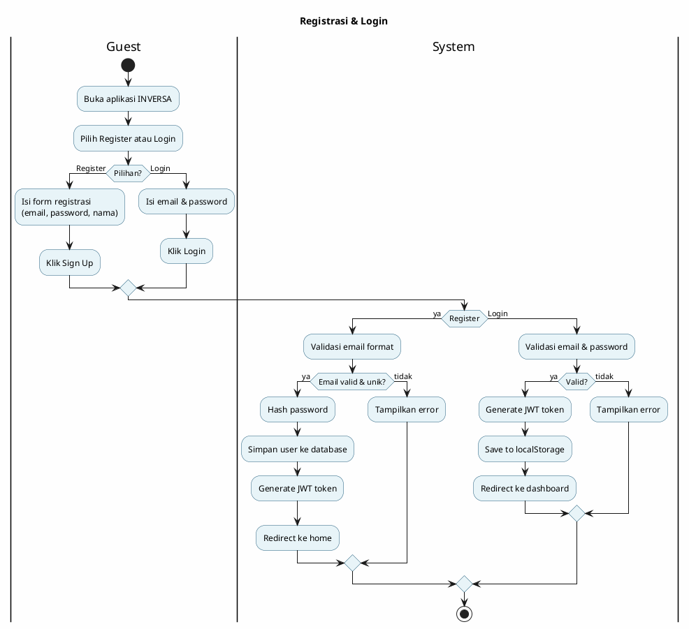
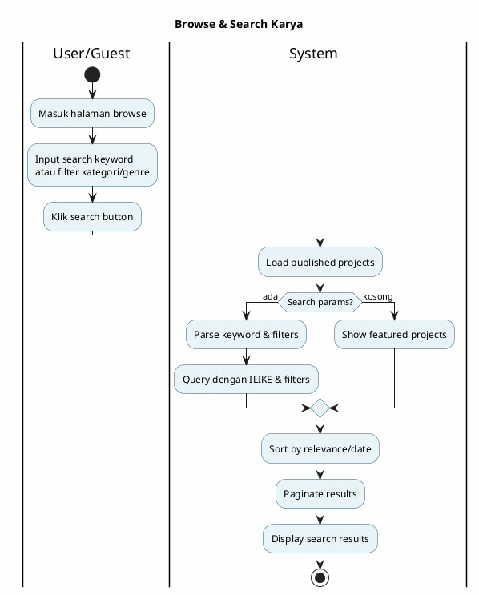
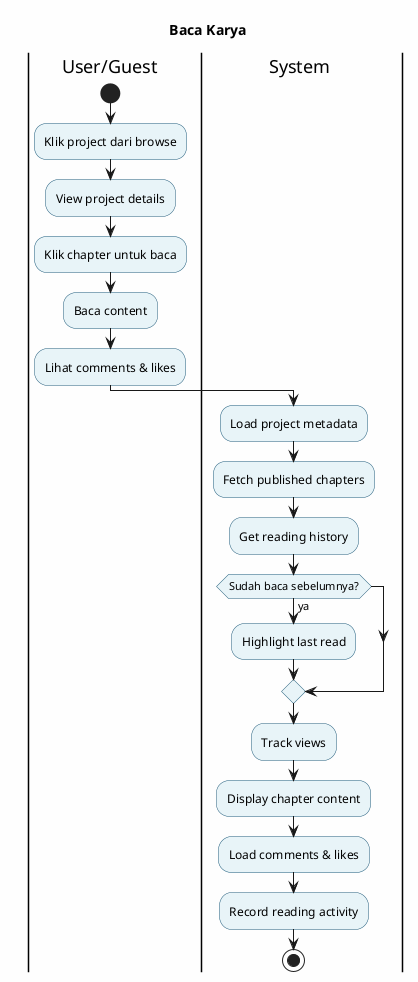
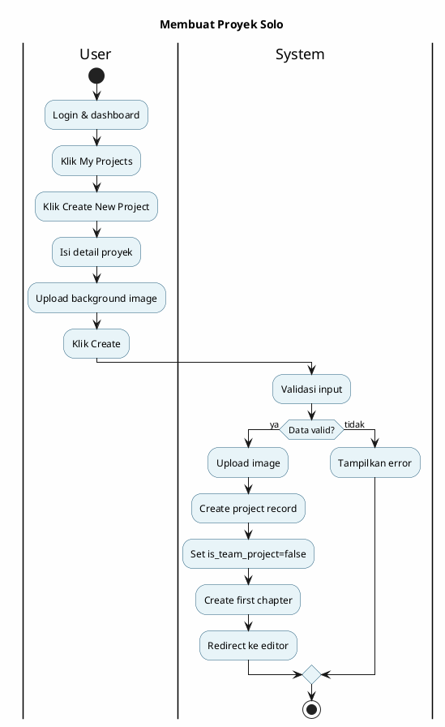
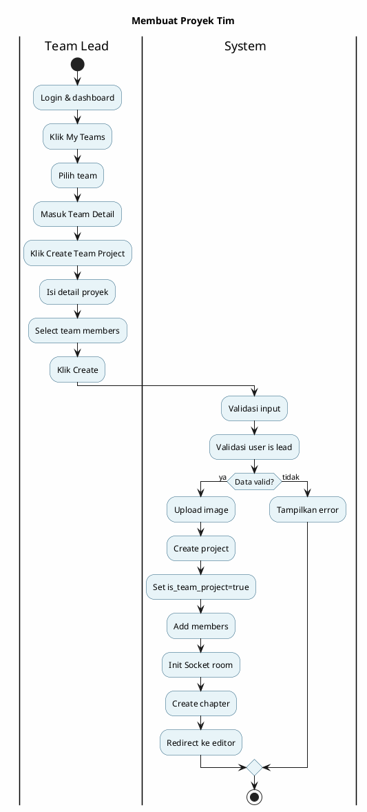
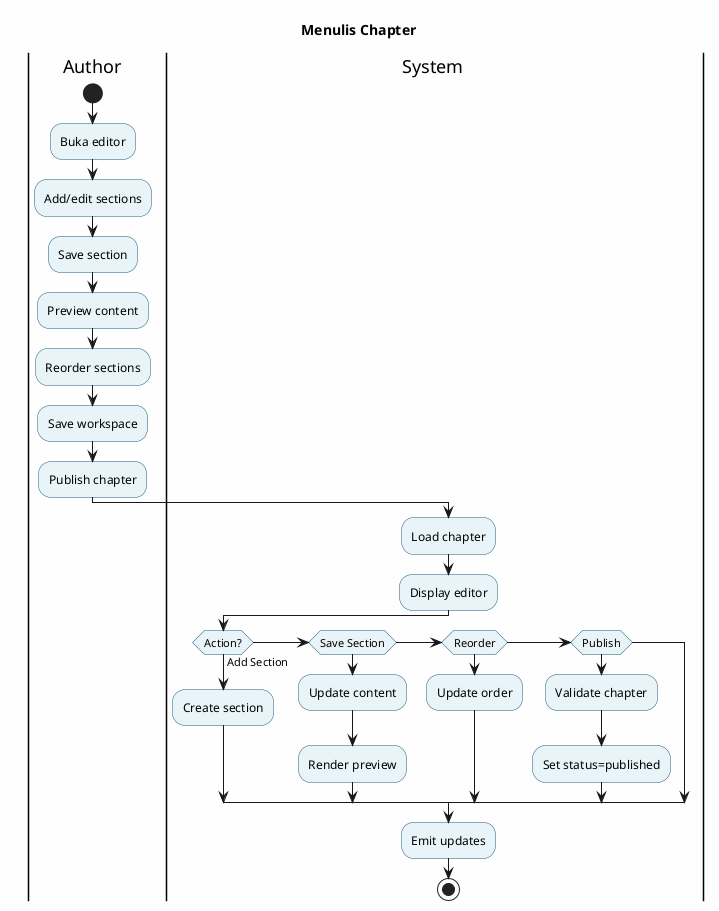
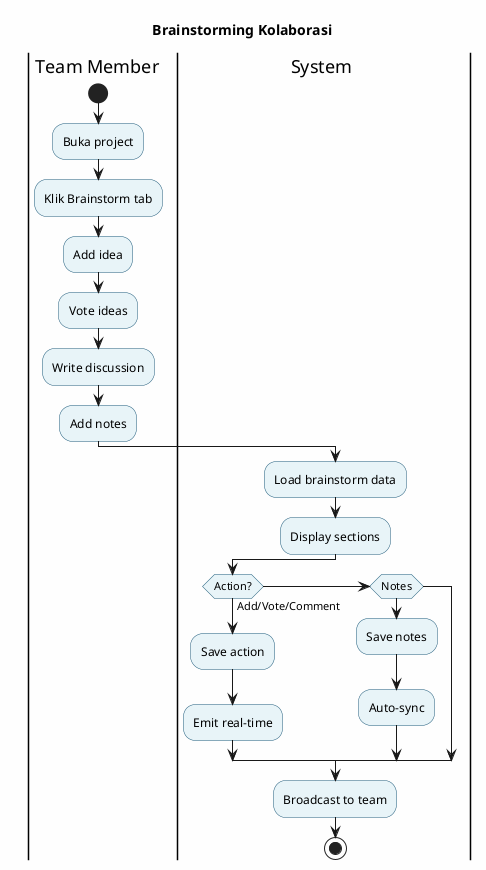
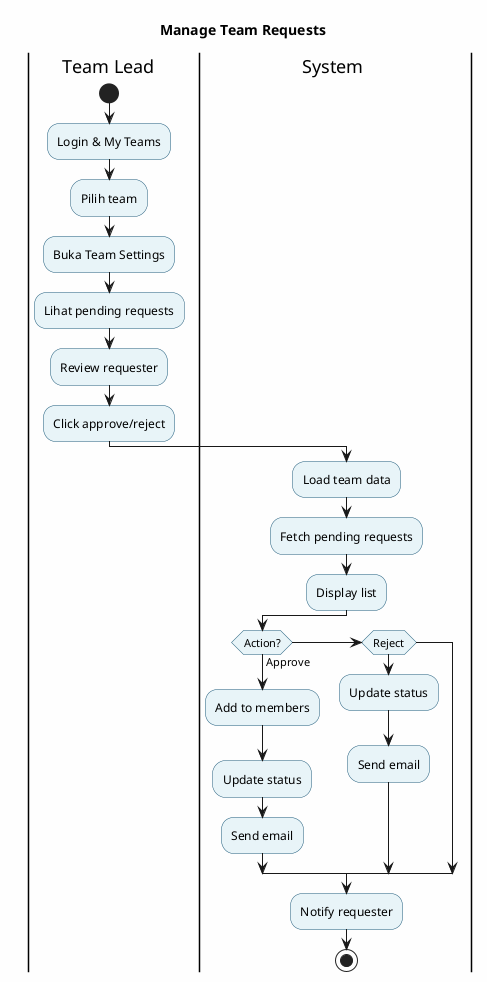
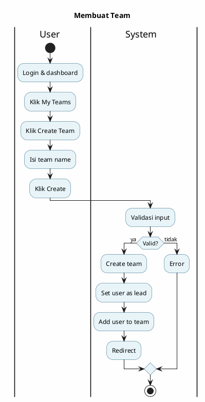
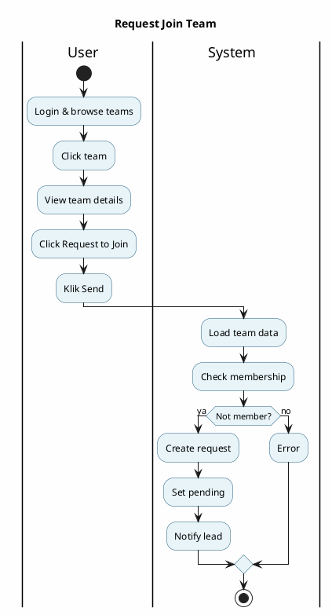

# PlantUML Diagrams - INVERSA Presentation
## Activity & Sequence Diagrams untuk 13 Main Use Cases
### Untuk Presentasi Skripsi Bab 3 - FIXED VERSION

---

## USE CASE 1: REGISTRASI & LOGIN

### Activity Diagram - Registrasi & Login



### Sequence Diagram - Registrasi & Login

```plantuml
@startuml RegistrasiLogin_Sequence
title Registrasi & Login
skinparam backgroundColor #FEFEFE
skinparam sequenceArrowColor #1E5A7A
skinparam actorBackgroundColor #E8F4F8
skinparam participantBackgroundColor #E8F4F8
skinparam LifeLineBorderColor #1E5A7A

actor Guest
participant "Frontend" as FE
participant "AuthController" as AC
database "PostgreSQL" as DB

Guest -> FE: Submit registrasi/login form
FE -> AC: POST /api/auth/authenticate\n(email, password, type)

alt Register
    AC -> DB: Check email exists
    DB --> AC: Email unik ✓
    AC -> AC: Hash password
    AC -> DB: INSERT user baru
    DB --> AC: User created
else Login
    AC -> DB: Query user by email
    DB --> AC: User data
    AC -> AC: Compare password
end

AC -> AC: Generate JWT token
AC --> FE: 200 OK {token, user}
FE -> FE: localStorage.setItem('authToken')
FE --> Guest: Redirect ke home/dashboard
stop

@enduml
```

---

## USE CASE 2: BROWSE & SEARCH KARYA

### Activity Diagram - Browse & Search Karya



### Sequence Diagram - Browse & Search Karya

```plantuml
@startuml BrowseSearch_Sequence
title Browse & Search Karya
skinparam backgroundColor #FEFEFE
skinparam sequenceArrowColor #1E5A7A
skinparam actorBackgroundColor #E8F4F8
skinparam participantBackgroundColor #E8F4F8
skinparam LifeLineBorderColor #1E5A7A

actor User
participant "Frontend\n(BrowsePage)" as FE
participant "ProjectController" as PC
database "PostgreSQL" as DB

User -> FE: Enter browse & search params
FE -> PC: GET /api/projects/search?\nq=keyword&category=X&genre=Y&page=1

PC -> PC: Build WHERE clause
PC -> DB: SELECT * FROM projects\nWHERE (title/desc ILIKE keyword)\nAND category_id=? AND genre_id=?\nAND status='published'\nORDER BY relevance DESC\nLIMIT 20 OFFSET 0
DB --> PC: search results
PC --> FE: {projects: [...], total: 45, page: 1}
FE --> User: Display results with pagination
stop

@enduml
```

---

## USE CASE 3: BACA KARYA

### Activity Diagram - Baca Karya



### Sequence Diagram - Baca Karya

```plantuml
@startuml BacaKarya_Sequence
title Baca Karya
skinparam backgroundColor #FEFEFE
skinparam sequenceArrowColor #1E5A7A
skinparam actorBackgroundColor #E8F4F8
skinparam participantBackgroundColor #E8F4F8
skinparam LifeLineBorderColor #1E5A7A

actor Reader
participant "Frontend\n(ChapterReader)" as FE
participant "ProjectController" as PC
database "PostgreSQL" as DB

Reader -> FE: Click chapter
FE -> PC: GET /api/chapters/{chapterId}

PC -> DB: SELECT * FROM chapters\nJOIN sections, likes, comments\nWHERE chapter_id=?
DB --> PC: chapter + sections + metadata
PC -> DB: UPDATE projects SET views++
DB --> PC: Updated

PC --> FE: {chapter, sections[], likes, comments}
FE -> PC: POST /api/reading-history\n(chapter_id, timestamp)
PC -> DB: INSERT/UPDATE reading_history
DB --> PC: Recorded

FE --> Reader: Display chapter with content
stop

@enduml
```

---

## USE CASE 4: MEMBUAT PROYEK SOLO

### Activity Diagram - Membuat Proyek Solo



### Sequence Diagram - Membuat Proyek Solo

```plantuml
@startuml BuatProyekSolo_Sequence
title Membuat Proyek Solo
skinparam backgroundColor #FEFEFE
skinparam sequenceArrowColor #1E5A7A
skinparam actorBackgroundColor #E8F4F8
skinparam participantBackgroundColor #E8F4F8
skinparam LifeLineBorderColor #1E5A7A

actor User
participant "Frontend\n(CreateProjectModal)" as FE
participant "ProjectController" as PC
participant "Storage" as ST
database "PostgreSQL" as DB

User -> FE: Submit project form
FE -> PC: POST /api/projects\n(title, desc, category, genre, image)

PC -> ST: Upload image
ST --> PC: {publicUrl}

PC -> DB: INSERT projects\n(title, initiator_id, is_team_project=false)
DB --> PC: {projectId}

PC -> DB: INSERT chapters\n(project_id, title='Chapter 1', status='draft')
DB --> PC: Chapter created

PC --> FE: 201 Created {projectId}
FE --> User: Redirect ke editor
stop

@enduml
```

---

## USE CASE 5: MEMBUAT PROYEK TIM

### Activity Diagram - Membuat Proyek Tim



### Sequence Diagram - Membuat Proyek Tim

```plantuml
@startuml BuatProyekTim_Sequence
title Membuat Proyek Tim
skinparam backgroundColor #FEFEFE
skinparam sequenceArrowColor #1E5A7A
skinparam actorBackgroundColor #E8F4F8
skinparam participantBackgroundColor #E8F4F8
skinparam LifeLineBorderColor #1E5A7A

actor TeamLead
participant "Frontend\n(TeamPage)" as FE
participant "ProjectController" as PC
participant "Storage" as ST
database "PostgreSQL" as DB
participant "Socket.io" as WS

TeamLead -> FE: Submit team project form
FE -> PC: POST /api/projects\n(teamId, title, image, members[])

PC -> ST: Upload image
ST --> PC: {publicUrl}

PC -> DB: INSERT projects\n(title, team_id, is_team_project=true)
DB --> PC: {projectId}

PC -> DB: INSERT project_members\n(project_id, user_id, role='member')
DB --> PC: Members added

PC -> DB: INSERT chapters\n(project_id, title='Chapter 1')
DB --> PC: Chapter created

PC -> WS: Create room 'project_{projectId}'
WS --> PC: Room created

PC --> FE: 201 Created
FE --> TeamLead: Redirect ke editor
stop

@enduml
```

---

## USE CASE 6: MENULIS CHAPTER

### Activity Diagram - Menulis Chapter



### Sequence Diagram - Menulis Chapter

```plantuml
@startuml MenulisChapter_Sequence
title Menulis Chapter
skinparam backgroundColor #FEFEFE
skinparam sequenceArrowColor #1E5A7A
skinparam actorBackgroundColor #E8F4F8
skinparam participantBackgroundColor #E8F4F8
skinparam LifeLineBorderColor #1E5A7A

actor Author
participant "Frontend\n(EditorLayout)" as FE
participant "SectionController" as SC
database "PostgreSQL" as DB

Author -> FE: Add new section
FE -> SC: POST /api/sections\n(chapter_id, type, order)
SC -> DB: INSERT sections
DB --> SC: {sectionId}
SC --> FE: Section added

Author -> FE: Edit section content
FE -> SC: PUT /api/sections/{sectionId}\n(content)
SC -> DB: UPDATE sections SET content=?
DB --> SC: Updated
SC --> FE: 200 OK

Author -> FE: Reorder sections
FE -> SC: PUT /api/chapters/{chapterId}/reorder\n(sections_array)
SC -> DB: BEGIN TRANSACTION; UPDATE...; COMMIT
DB --> SC: Reordered
SC --> FE: 200 OK

Author -> FE: Publish chapter
FE -> SC: POST /api/chapters/{chapterId}/publish
SC -> DB: UPDATE chapters SET status='published'
DB --> SC: Published
SC --> FE: 200 OK
FE --> Author: Success message
stop

@enduml
```

---

## USE CASE 7: BRAINSTORMING KOLABORASI

### Activity Diagram - Brainstorming Kolaborasi



### Sequence Diagram - Brainstorming Kolaborasi

```plantuml
@startuml Brainstorming_Sequence
title Brainstorming Kolaborasi
skinparam backgroundColor #FEFEFE
skinparam sequenceArrowColor #1E5A7A
skinparam actorBackgroundColor #E8F4F8
skinparam participantBackgroundColor #E8F4F8
skinparam LifeLineBorderColor #1E5A7A

actor Member1
participant "Frontend\n(BrainstormPanel)" as FE
participant "BrainstormController" as BC
database "PostgreSQL" as DB
participant "WebSocket" as WS

Member1 -> FE: Perform brainstorm action
FE -> BC: POST /api/brainstorm/{projectId}/action\n(type: idea/vote/discussion/notes, data)

alt Add Idea
    BC -> DB: INSERT ideas
else Vote Idea
    BC -> DB: INSERT/DELETE votes
else Add Discussion
    BC -> DB: INSERT discussions
else Add Notes
    BC -> DB: INSERT/UPDATE notes
end

DB --> BC: Success
BC --> FE: 201/200 Created/OK
FE -> WS: emit 'brainstorm_updated'
WS --> FE: Broadcast to team
FE --> Member1: Update UI real-time
stop

@enduml
```

---

## USE CASE 8: MANAGE TEAM REQUESTS

### Activity Diagram - Manage Team Requests



### Sequence Diagram - Manage Team Requests

```plantuml
@startuml ManageTeamRequests_Sequence
title Manage Team Requests
skinparam backgroundColor #FEFEFE
skinparam sequenceArrowColor #1E5A7A
skinparam actorBackgroundColor #E8F4F8
skinparam participantBackgroundColor #E8F4F8
skinparam LifeLineBorderColor #1E5A7A

actor TeamLead
participant "Frontend\n(TeamSettings)" as FE
participant "TeamController" as TC
database "PostgreSQL" as DB
participant "Email" as ES

TeamLead -> FE: Click approve/reject
FE -> TC: PATCH /api/team-requests/{requestId}\n(action: approve/reject)

alt Approve
    TC -> DB: UPDATE team_requests SET status='approved'
    TC -> DB: INSERT team_members
else Reject
    TC -> DB: UPDATE team_requests SET status='rejected'
end

DB --> TC: Updated
TC -> ES: Send notification email
ES --> TC: Email sent
TC --> FE: 200 OK
FE --> TeamLead: Update UI, remove from pending
stop

@enduml
```

---

## USE CASE 9: MEMBUAT TEAM

### Activity Diagram - Membuat Team



### Sequence Diagram - Membuat Team

```plantuml
@startuml BuatTeam_Sequence
title Membuat Team
skinparam backgroundColor #FEFEFE
skinparam sequenceArrowColor #1E5A7A
skinparam actorBackgroundColor #E8F4F8
skinparam participantBackgroundColor #E8F4F8
skinparam LifeLineBorderColor #1E5A7A

actor User
participant "Frontend\n(CreateTeamModal)" as FE
participant "TeamController" as TC
database "PostgreSQL" as DB

User -> FE: Submit team form
FE -> TC: POST /api/teams\n(name, description)

TC -> DB: INSERT teams\n(name, team_lead_id)
DB --> TC: {teamId}

TC -> DB: INSERT team_members\n(team_id, user_id, role='lead')
DB --> TC: Member added

TC --> FE: 201 Created
FE --> User: Redirect ke team page
stop

@enduml
```

---

## USE CASE 10: REQUEST JOIN TEAM

### Activity Diagram - Request Join Team



### Sequence Diagram - Request Join Team

```plantuml
@startuml RequestJoinTeam_Sequence
title Request Join Team
skinparam backgroundColor #FEFEFE
skinparam sequenceArrowColor #1E5A7A
skinparam actorBackgroundColor #E8F4F8
skinparam participantBackgroundColor #E8F4F8
skinparam LifeLineBorderColor #1E5A7A

actor User
participant "Frontend\n(TeamDetail)" as FE
participant "TeamController" as TC
database "PostgreSQL" as DB
participant "Notification" as NT

User -> FE: Click Request to Join
FE -> TC: POST /api/team-requests\n(team_id, message?)

TC -> DB: CHECK not already member
DB --> TC: OK
TC -> DB: INSERT team_requests\n(team_id, user_id, status='pending')
DB --> TC: {requestId}

TC -> NT: Notify team lead
NT --> TC: Notification sent

TC --> FE: 201 Created
FE --> User: Success message
stop

@enduml
```

---

## USE CASE 11: BRAINSTORMING TEAM

### Activity Diagram - Brainstorming Team

```plantuml
@startuml BrainstormingTeam_Activity
title Brainstorming Team
skinparam backgroundColor #FEFEFE
skinparam activityBackgroundColor #E8F4F8
skinparam activityBorderColor #1E5A7A
skinparam swimlaneWidth 300

|Team Member|
start
:Buka team project;
:Klik Brainstorm;
:Collaborate;
(ideas, votes, discussion, notes);

|System|
:Load brainstorm;
:Display all;
:Accept actions;
:Save to DB;
:Emit real-time;
:Broadcast;
stop

@enduml
```

### Sequence Diagram - Brainstorming Team

```plantuml
@startuml BrainstormingTeam_Sequence
title Brainstorming Team
skinparam backgroundColor #FEFEFE
skinparam sequenceArrowColor #1E5A7A
skinparam actorBackgroundColor #E8F4F8
skinparam participantBackgroundColor #E8F4F8
skinparam LifeLineBorderColor #1E5A7A

actor Member
participant "Frontend\n(Brainstorm)" as FE
participant "BrainstormController" as BC
database "PostgreSQL" as DB
participant "Socket.io" as WS

Member -> FE: Perform brainstorm action
FE -> BC: POST /api/brainstorm/{projectId}/\n(action_data)

BC -> DB: INSERT/UPDATE brainstorm data
DB --> BC: Success
BC --> FE: 201/200 OK
FE -> WS: emit 'brainstorm_action'
WS --> FE: Broadcast to team
FE --> Member: Update UI
stop

@enduml
```

---

## USE CASE 12: MEMBER FEEDBACK (LIKE & KOMENTAR)

### Activity Diagram - Member Feedback

```plantuml
@startuml MemberFeedback_Activity
title Member Feedback
skinparam backgroundColor #FEFEFE
skinparam activityBackgroundColor #E8F4F8
skinparam activityBorderColor #1E5A7A
skinparam swimlaneWidth 300

|User/Member|
start
:Baca chapter;
:Click like/unlike;
:Atau tulis komentar;
:Submit;

|System|
:Load chapter;
if (Like?) then (ya)
    :Toggle like;
    :Update count;
elseif (Komentar)
    :Validate text;
    :Save comment;
endif
:Emit update;
:Notify;
stop

@enduml
```

### Sequence Diagram - Member Feedback

```plantuml
@startuml MemberFeedback_Sequence
title Member Feedback
skinparam backgroundColor #FEFEFE
skinparam sequenceArrowColor #1E5A7A
skinparam actorBackgroundColor #E8F4F8
skinparam participantBackgroundColor #E8F4F8
skinparam LifeLineBorderColor #1E5A7A

actor Reader
participant "Frontend\n(ChapterReader)" as FE
participant "ProjectController" as PC
database "PostgreSQL" as DB
participant "WebSocket" as WS

Reader -> FE: Click like / Write comment
FE -> PC: POST /api/feedback\n(action: like/comment, data)

alt Like
    PC -> DB: INSERT/DELETE like
    PC -> DB: UPDATE like_count
else Comment
    PC -> DB: INSERT comment
end

DB --> PC: Success
PC --> FE: 200 OK
FE -> WS: emit 'feedback_updated'
WS --> FE: Update UI
FE --> Reader: Show updated count/comment
stop

@enduml
```

---

## USE CASE 13: ADMIN PANEL & CONTENT MANAGEMENT

### Activity Diagram - Admin Panel & Content Management

```plantuml
@startuml AdminPanel_Activity
title Admin Panel & Content Management
skinparam backgroundColor #FEFEFE
skinparam activityBackgroundColor #E8F4F8
skinparam activityBorderColor #1E5A7A
skinparam swimlaneWidth 300

|Admin|
start
:Login as admin;
:Open dashboard;
:View statistics;
:Access admin features
(users, reports, analytics);

|System|
:Validate admin role;
:Load dashboard;
:Calculate stats;
:Fetch data;
:Display;
stop

@enduml
```

### Sequence Diagram - Admin Panel & Content Management

```plantuml
@startuml AdminPanel_Sequence
title Admin Panel & Content Management
skinparam backgroundColor #FEFEFE
skinparam sequenceArrowColor #1E5A7A
skinparam actorBackgroundColor #E8F4F8
skinparam participantBackgroundColor #E8F4F8
skinparam LifeLineBorderColor #1E5A7A

actor Admin
participant "Frontend\n(AdminDashboard)" as FE
participant "AdminController" as AC
database "PostgreSQL" as DB

Admin -> FE: Open admin panel
FE -> AC: GET /api/admin/dashboard

AC -> DB: SELECT COUNT(*) FROM users/projects/chapters
DB --> AC: {stats}
AC --> FE: {totalUsers, totalProjects, published}

FE --> Admin: Display dashboard
stop

@enduml
```

---

## SUMMARY - ALL 13 USE CASES FIXED ✅

✅ **All Activity Diagrams:** Have single `stop` point
✅ **All Sequence Diagrams:** Have single `stop` point
✅ **All Endpoints:** Single main endpoint per use case
✅ **Alt branches:** Used correctly (no multiple stop points)

**Ready for presentation!** 🎉
